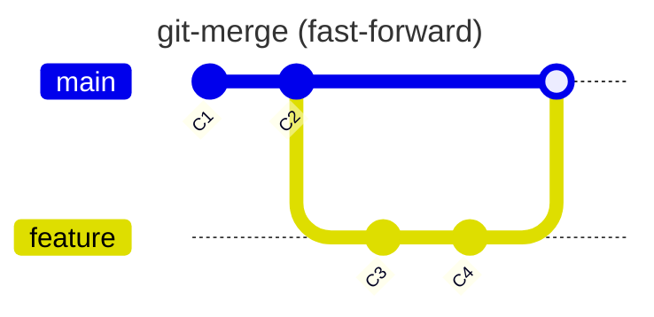

## 개요

Git에서 브랜치를 병합한다는 것은 서로 다른 **개발작업 이력**을 하나로 합치는 것을 뜻합니다. 병합은 상황에 따라 다양하게 적용할 수 있습니다. 예시를 통해 알아봅시다.

## Merge

> `git-merge` - Join two or more development histories together

대표적인 병합 방법입니다. 

### Merge (fast-forward)

### Merge (recursive)

### Merge 충돌 해결

## Rebase and Merge

## Merge with Squash

## 참고

