## 정의

퀵 정렬(Quick Sort)은 분할 정복(Divide and Conquer) 알고리즘에 기반한 정렬 알고리즘입니다. 퀵 정렬은 병합 정렬(Merge Sort)과 마찬가지로 배열을 **재귀적**으로 분할하지만, 병합 단계 없이 분할 과정에서 정렬을 수행한다는 점이 다릅니다. 이는 퀵 정렬이 매우 빠르고 공간 효율적이게 만드는 주요 특징 중 하나입니다.

## 알고리즘 단계

1. 피벗 선택(Pivot Selection)

   - 배열에서 하나의 원소를 피벗(pivot)으로 선택합니다. 피벗 선택 방법은 다양하며 보통 첫 번째, 마지막, 중간 원소, 또는 무작위로 선택하는 방식이 사용됩니다.

2. 분할(Partitioning)

   - 피벗을 기준으로 배열을 두 개의 하위 배열로 분할합니다. 피벗보다 작은 원소들은 피벗의 왼쪽 하위 배열에, 피벗보다 큰 원소들은 오른쪽 하위 배열에 위치시킵니다. 피벗은 최종적으로 두 하위 배열 사이의 올바른(정렬된) 위치에 놓이게 됩니다.

3. 재귀적 정렬(Recursive Sort)
   
   - 분할된 두 하위 배열에 대해 재귀적으로 퀵 정렬을 수행합니다.

4. 정렬 완료

   - 재귀 호출이 완료되면 모든 하위 배열이 정렬되고, 전체 배열이 정렬된 상태가 됩니다.

## Pseudo Code

```python
QUICK-SORT(array, low, high)
    If low < high
        pivotIndex = PARTITION(array, low, high)
        QUICK-SORT(array, low, pivotIndex - 1)
        QUICK-SORT(array, pivotIndex + 1, high)

PARTITION(array, low, high)
    pivot = array[high]  // Choosing the last element as the pivot
    i = low
    j = high - 1
    
    While i <= j
      While i <= high-1 and pivot >= array[i]
         i = i + 1
      While j >= low and pivot <= array[j]
         j = j + 1
      If i <= j
         Swap array[i] with array[j]
    Swap array[i] with array[high]
    Return i
```

> 위 분할(partition) 알고리즘은 Tony Hoare이 제안한 방법입니다. 피벗이 배열의 어느 위치에 선택되었는지에 따라 low 또는 high 포인터와의 교환이 결정됩니다. 본문에서는 **마지막 요소가 피벗인 경우**를 기준으로 하고 있습니다.
- 마지막 요소가 피벗일 때: low 포인터와 교환
- 첫 번째 요소가 피벗일 때: high 포인터와 교환
- 중간 요소가 피벗일 때: 상황에 따라 low 또는 high 포인터와 교환
{: .prompt-info}

## 성능

### 시간 복잡도

퀵 정렬의 시간 복잡도는 피벗 선택 방법과 데이터의 분포에 따라 다릅니다.

1. 최선의 경우(Best Case): $O(n \log n)$

   - 피벗이 항상 배열의 중앙에 가까운 경우, 배열이 매번 균등하게 분할되어 로그 깊이의 재귀 호출이 필요합니다.

2. 평균의 경우(Average Case): $O(n \log n)$

   - 대부분의 경우, 피벗이 배열을 적당히 균등하게 분할하기 때문에 로그 깊이의 재귀 호출이 필요합니다.

3. 최악의 경우(Worst Case): $O(n^2)$

   - 피벗이 배열의 최댓값이나 최솟값으로 선택되어, 배열이 최대한 불균형하게 분할되는 경우입니다. 예를 들어, 이미 정렬된 배열에 대해 첫 번째 또는 마지막 원소를 항상 피벗으로 선택하면 최악의 성능을 보입니다.

### 공간 복잡도

퀵 정렬은 추가적인 메모리를 거의 사용하지 않고 제자리에서(in-place) 정렬을 수행합니다. 그러나 재귀 호출로 인해 호출 스택에 로그 깊이의 추가 공간이 필요합니다. 즉 공간 복잡도가 $O(\log n)$인 알고리즘입니다.


## 예시

### 문제 1

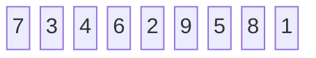


#### 피벗 선택

마지막 원소를 피벗으로 선택하는 방식을 취한다. 초기에 선택되는 피벗의 값은 <kbd>1</kbd>이다.

#### 분할

피벗보다 작은 원소들은 피벗의 왼쪽 하위 배열에, 피벗보다 큰 원소들은 오른쪽 하위 배열에 위치시킨다.

- **pivot**: 위 문장과 같이 피벗을 중심으로 원소들의 크기가 좌우로 정렬된다. 아래의 풀이에서 <mark style='background-color: #80A924'><font color="white">초록색</font></mark>으로 표기하고, 풀이 애니메이션에서는 P로 표기한다.

- **low**: 피벗을 제외한 가장 왼쪽에 위치한 지점을 초깃값으로 가리키며 low 포인터 또는 마커라고 불린다. 아래의 풀이에서 <mark style='background-color: #D02519'><font color="white">빨간색</font></mark>으로 표기하고, 풀이 애니메이션에서는 L로 표기한다. 피벗보다 큰 값을 만날 때까지 오른쪽으로 이동한다.

- **high**: 피벗을 제외한 가장 왼쪽에 위치한 지점을 초깃값 가리키며 low 포인터 또는 마커라고 불린다. 아래의 풀이에서 <mark style='background-color: #3F53D2'><font color="white">파란색</font></mark>으로 표기하고, 예시 애니메이션에서는 R로 표기한다. 피벗보다 작은 값을 만날 때까지 왼쪽으로 이동한다.

##### 1

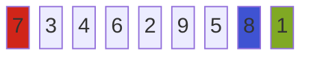

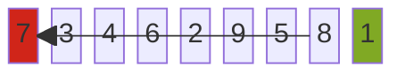

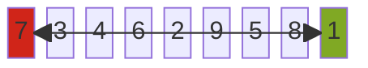

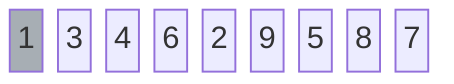

##### 2

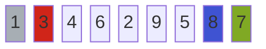

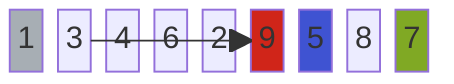

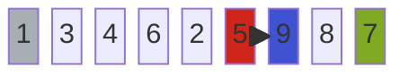

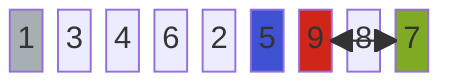

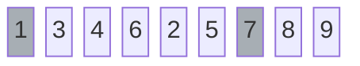

##### 3

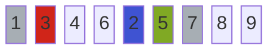

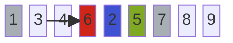

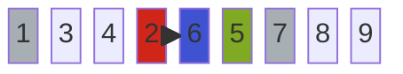

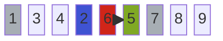

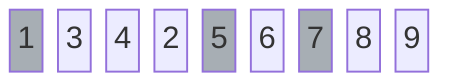

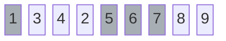

##### 4

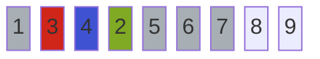

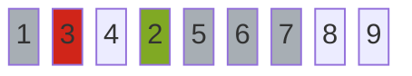

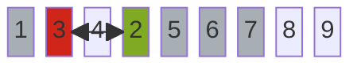

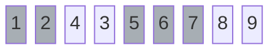

##### 5

```mermaid
block-beta
    columns 9
        1 2 4 3 5 6 7 8 9
    style 1 fill:#A7AEB4,color:#fff
    style 7 fill:#A7AEB4,color:#fff
    style 5 fill:#A7AEB4,color:#fff
    style 2 fill:#A7AEB4,color:#fff
    style 3 fill:#80A924,color:#fff
    style 4 fill:#D02519,color:#fff
    style 6 fill:#A7AEB4,color:#fff
```

```mermaid
block-beta
    columns 9
        1 2 4 3 5 6 7 8 9
    style 1 fill:#A7AEB4,color:#fff
    style 7 fill:#A7AEB4,color:#fff
    style 5 fill:#A7AEB4,color:#fff
    style 2 fill:#A7AEB4,color:#fff
    style 3 fill:#80A924,color:#fff
    style 4 fill:#D02519,color:#fff
    style 6 fill:#A7AEB4,color:#fff
    4 --> 3
    3 --> 4
```

```mermaid
block-beta
    columns 9
        1 2 3 4 5 6 7 8 9
    style 1 fill:#A7AEB4,color:#fff
    style 7 fill:#A7AEB4,color:#fff
    style 5 fill:#A7AEB4,color:#fff
    style 2 fill:#A7AEB4,color:#fff
    style 3 fill:#A7AEB4,color:#fff
    style 6 fill:#A7AEB4,color:#fff
```

```mermaid
block-beta
    columns 9
        1 2 3 4 5 6 7 8 9
    style 1 fill:#A7AEB4,color:#fff
    style 7 fill:#A7AEB4,color:#fff
    style 5 fill:#A7AEB4,color:#fff
    style 2 fill:#A7AEB4,color:#fff
    style 3 fill:#A7AEB4,color:#fff
    style 6 fill:#A7AEB4,color:#fff
    style 4 fill:#A7AEB4,color:#fff
```

##### 6

```mermaid
block-beta
    columns 9
        1 2 3 4 5 6 7 8 9
    style 1 fill:#A7AEB4,color:#fff
    style 7 fill:#A7AEB4,color:#fff
    style 5 fill:#A7AEB4,color:#fff
    style 2 fill:#A7AEB4,color:#fff
    style 3 fill:#A7AEB4,color:#fff
    style 6 fill:#A7AEB4,color:#fff
    style 4 fill:#A7AEB4,color:#fff
    style 8 fill:#3F53D2,color:#fff
    style 9 fill:#80A924,color:#fff
```

```mermaid
block-beta
    columns 9
        1 2 3 4 5 6 7 8 9
    style 1 fill:#A7AEB4,color:#fff
    style 7 fill:#A7AEB4,color:#fff
    style 5 fill:#A7AEB4,color:#fff
    style 2 fill:#A7AEB4,color:#fff
    style 3 fill:#A7AEB4,color:#fff
    style 6 fill:#A7AEB4,color:#fff
    style 4 fill:#A7AEB4,color:#fff
    style 9 fill:#A7AEB4,color:#fff
```

```mermaid
block-beta
    columns 9
        1 2 3 4 5 6 7 8 9
    style 1 fill:#A7AEB4,color:#fff
    style 7 fill:#A7AEB4,color:#fff
    style 5 fill:#A7AEB4,color:#fff
    style 2 fill:#A7AEB4,color:#fff
    style 3 fill:#A7AEB4,color:#fff
    style 6 fill:#A7AEB4,color:#fff
    style 4 fill:#A7AEB4,color:#fff
    style 8 fill:#A7AEB4,color:#fff
    style 9 fill:#A7AEB4,color:#fff
```

#### 정렬 완료

```mermaid
block-beta
    columns 9
        1 2 3 4 5 6 7 8 9
```

#### 풀이 애니메이션

> 출처: http://algorithm.wiki/


## 참고

- 구종만, 알고리즘 문제 해결 전략 1, 인사이트(2012)
- 윤성우, 열혈 자료구조, 오렌지미디어(2012)
- 위키피디아, Quicksort, https://en.wikipedia.org/wiki/Tony_Hoare