깊이 우선 탐색 알고리즘을 정리한다.

---

## 정의

DFS is an algorithm for traversing or searching a tree or graph. Starting from the root (or an arbitrary node in the case of a graph), it explores as far as possible along each branch before backtracking.

---

## 주요 특징

### **1. Traversal Method**

- DFS uses a LIFO (Last in, First Out) structure, typically implemented with **a stack**, either explicitly (using **a stack data structure**) or implicitly (via **recursion**).

### **2. Exploration Strategy**

- It explores nodes and branches to the maximum depth of the structure before backtracking.

### **3. Graph Types**

- It can be used for both directed and undirected graphs.

---

## 알고리즘 단계

### Iterative DFS

1. **Initialization**
	1. **Start** at the root node (or any arbitrary node in the case of a graph).
	2. **Mark** the starting node as visited.
	3. **Push** the starting node onto the stack.
2. **Exploration**
	1. If the stack is **not empty**:
		1. **Pop** the top node from the stack, which is the current node.
	2. For each **unvisited adjacent nodes** of the current node:
		1. **Mark** the adjacent node as visited.
		2. **Push** the adjacent node onto the stack.
3. **Termination:** **Repeat** step 2 until all nodes are visited.


> **Iterative DFS** uses a stack to manage the nodes to be visited, explicitly handling the backtracking process by pushing and popping nodes.
{: .prompt-info}


### Recursive DFS

1. **Initialization**
	1. **Start** at the root node (or any arbitrary node in the case of a graph).
2. **Exploration** via DFS() on the input node
	1. **Mark** the input node as visited, which is the current node.
	2. For each **unvisited adjacent nodes** of the current node:
		1. **Recursively call** DFS() on the adjacent node.
3. **Termination:** **Repeat** step 2 until all nodes are visited.


> **Recursive DFS** uses the call stack of the programming language to manage the nodes to be visited, implicitly handling the backtracking process through recursive function calls.
{: .prompt-info}

---

## 유사코드

### 반복문(Iterative)

```python
DFS(graph, start):
    create a stack S
    mark start as visited
    push start onto S
    while S is not empty:
        current = S.pop()
        // you can add your processing code here
        for each neighbor of current:
            if neighbor is not visited:
                mark neighbor as visited
                push neighbor onto S
```

### 재귀법(Recursive)

```python
DFS(graph, node):
    mark node as visited
    // you can add your processing code here
    for each neighbor of node:
        if neighbor is not visited:
            DFS(graph, neighbor)
```

---
## 비교: Iterative DFS vs. Recursive DFS

### Implementation

- **Iterative**: Uses a stack data structure to keep track of the exploration path. The algorithm explicitly loops through the steps of pushing, popping, visiting, and exploring neighbors.

- **Recursive**: Relies on function calls to manage the exploration path. Each function call represents a step in the exploration, and recursion continues until all reachable nodes are visited.

### Memory Usage

- **Iterative**: Generally has lower memory overhead compared to the recursive approach. The iterative approach uses a fixed-size stack to manage the exploration. Memory usage depends on the size of the explicit stack.

- **Recursive**: Can have higher memory usage due to the function call stack. Each recursive call adds an entry to the stack, which can become significant for deep explorations or large graphs. Memory usage depends on the depth of the recursion.

### Control Flow

- **Iterative**: Offers more explicit control over the exploration process. You can easily modify the loop conditions or add additional checks within the loop.

- **Recursive**: The control flow is managed through function calls and return statements. While offering a concise representation, it can be less intuitive to modify specific exploration logic within the recursive structure.

### Performance

- **Iterative**: Typically has constance time complexity for push and pop operations on the stack. Performance can be slightly better in environments where deep recursion is a bottleneck.

- **Recursive**: Function calls can add overhead due to the. creation of stack frames. Performance is generally similar to iterative DFS for shallow graphs but can degrade for very deep graphs due to recursion overhead.

---
## 예제

### 1. 간단한 트리 구조

#### 문제

아래와 같은 트리에서 DFS 방식을 적용하여 탐색하시오. 탐색은 A 노드에서 시작한다.

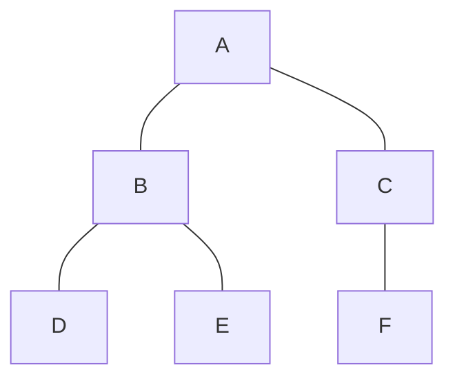

#### 풀이 1. Iterative approach

1. **Initialization**
- Start at node A
- Mark node A as visited.
- Push node A onto the stack.
- Stack: [A]
- Visited: [A]
- Processed: [ ]

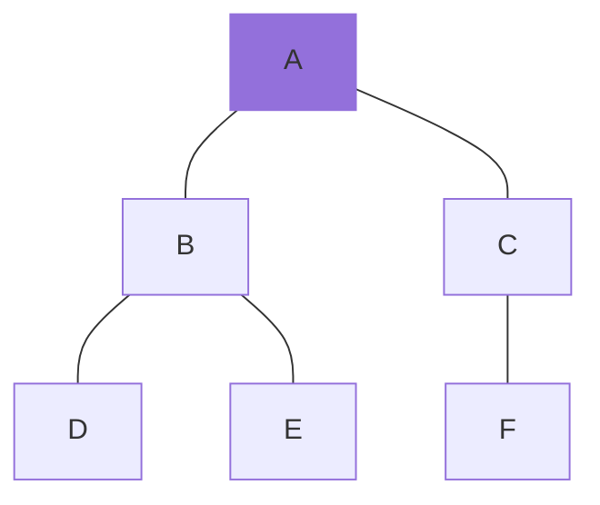

2. **Step 1**
- Pop node A from the stack
- Process(A)
- Push its unvisited adjacent nodes B and C onto the stack (order may vary)
- Mark node B and C as visited
- Stack: [C, B]
- Visited: [A, B, C]
- Processed: [A]

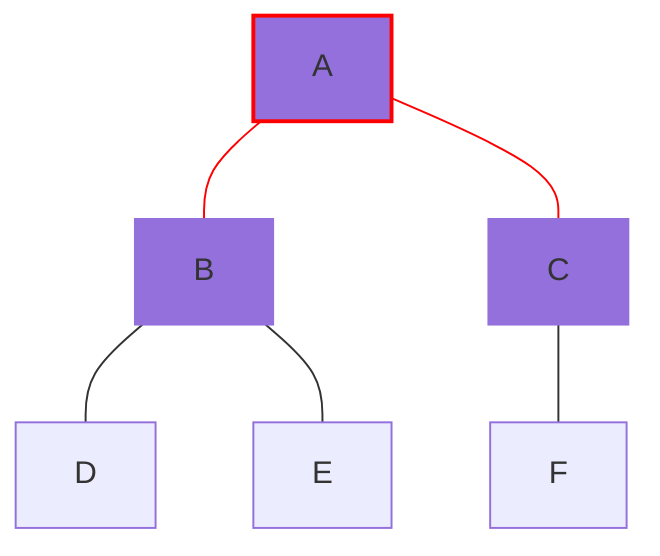

3. **Step 2**
- Pop node B from the stack
- Process(B)
- Push its unvisited adjacent nodes D and E onto the stack (order may vary)
- Mark node D and E as visited
- Stack: [C, E, D]
- Visited: [A, B, C, D, E]
- Processed: [A, B]

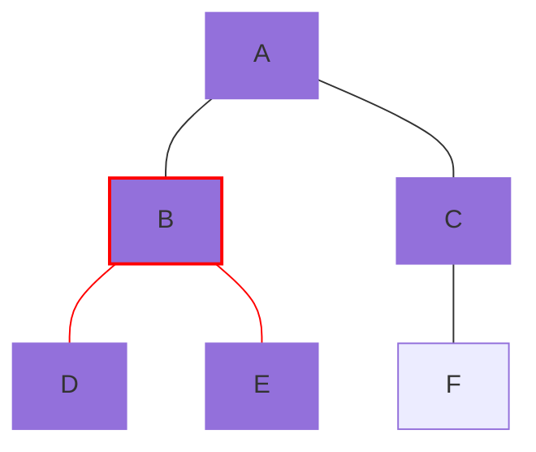

4. **Step 3**
- Pop node D from the stack
- Process(D)
- Node D has no unvisited adjacent nodes to push
- Stack: [C, E]
- Visited: [A, B, C, D, E]
- Processed: [A, B, D]

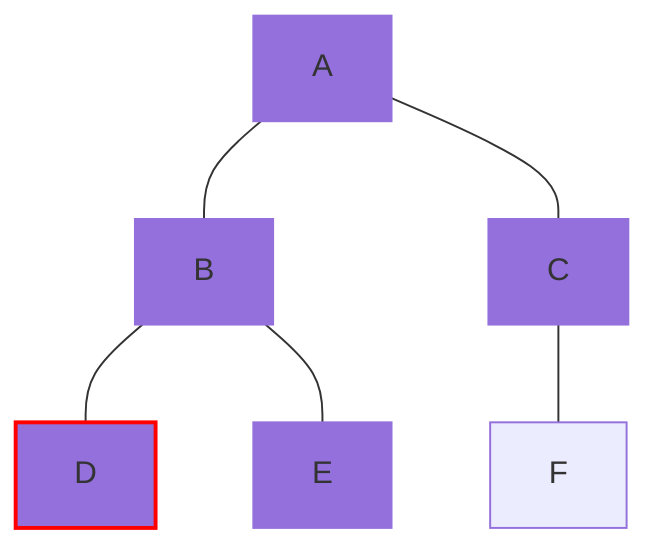

5. **Step 4**
- Pop node E from the stack
- Process(E)
- Node E has no unvisited adjacent nodes to push
- Stack: [C]
- Visited: [A, B, C, D, E]
- Processed: [A, B, D, E]

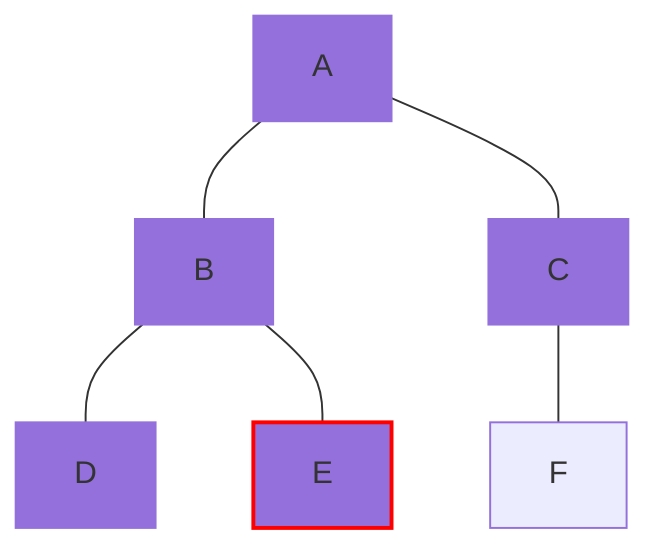

6. **Step 5**
- Pop node C from the stack
- Process(C)
- Push its unvisited adjacent node F onto the stack
- Mark node F as visited
- Stack: [F]
- Visited: [A, B, C, D, E, F]
- Processed: [A, B, D, E, C]

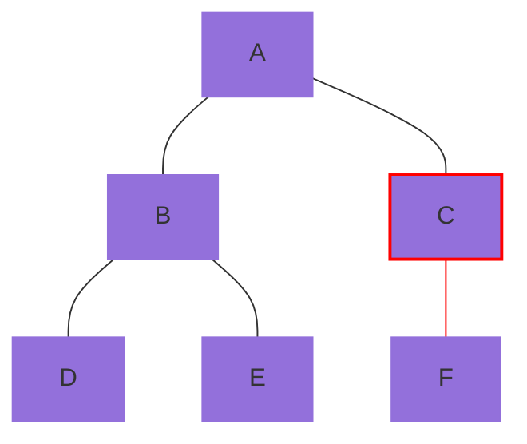

7. **Step 6**
- Pop node F from the stack
- Process(F)
- Node F has no unvisited adjacent nodes to push
- Stack: [ ]
- Visited: [A, B, C, D, E, F]
- Processed: [A, B, D, E, C, F]


8. **End**
- The DFS traversal order is A -> B -> D -> E -> C -> F.

> We have the same result as the recursive DFS as below because we pushed unvisited adjacent nodes onto the stack in reverse order. Otherwise, the traversal order would be A -> C -> F -> B -> E -> D.
{: .prompt-info}

#### 풀이 2. Recursive approach

1. **Call DFS(A)**
- Start at node A
- Mark node A as visited
- Process(A)
- Visit its adjacent nodes B and C
- Call Stack: [A]
- Visited: [A]
- Processed: [A]

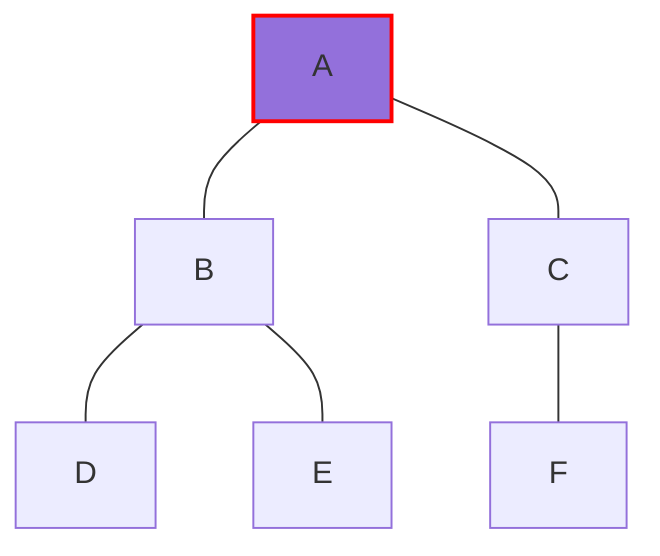

2. **Call DFS(B)**
- Mark node B as visited
- Process(B)
- Visit its adjacent nodes D and E
- Call Stack: [A, B]
- Visited: [A, B]
- Processed: [A, B]

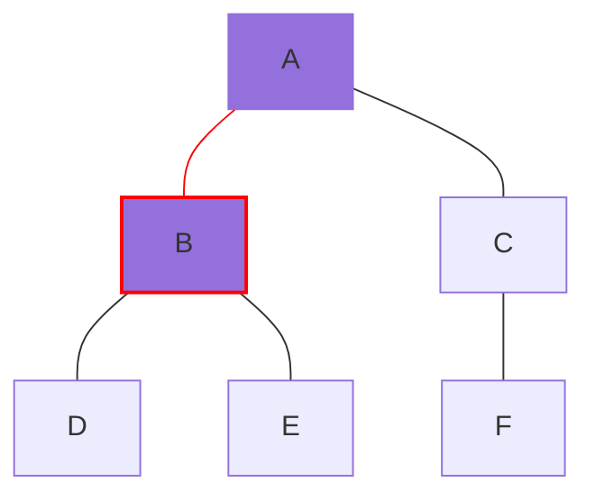

3. **Call DFS(D)**
- Mark node D as visited
- Process(D)
- Node D has no unvisited adjacent nodes
- Call Stack: [A, B, D]
- Visited: [A, B, D]
- Processed: [A, B, D]

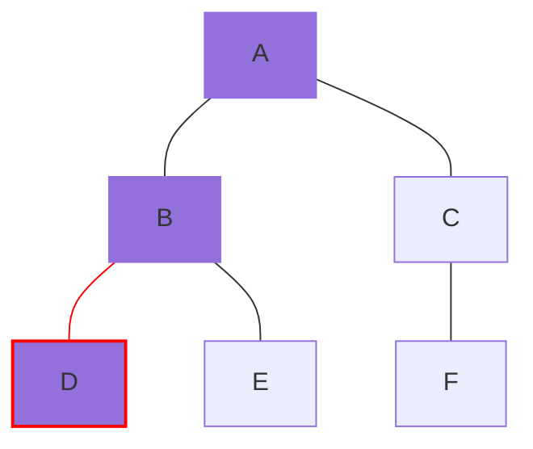

4. **Return to DFS(B) and call DFS(E)**
- Mark node E as visited
- Process(E)
- Node E has no unvisited adjacent nodes
- Call Stack: [A, B, E]
- Visited: [A, B, D, E]
- Processed: [A, B, D, E]

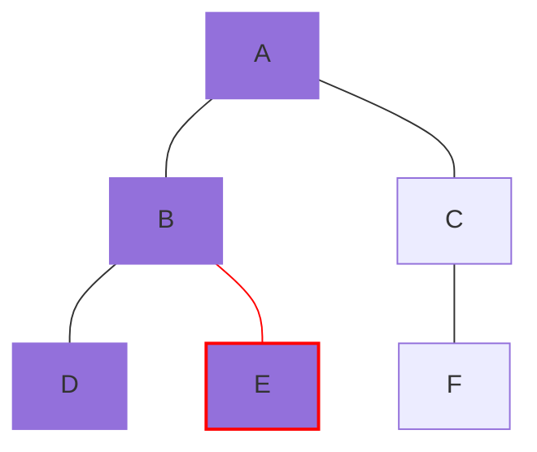

5. **Return to DFS(B) and DFS(A); and call DFS(C)**
- Mark node C as visited
- Visit its adjacent node F
- Call Stack: [A, C]
- Visited: [A, B, D, E, C]
- Processed: [A, B, D, E, C]

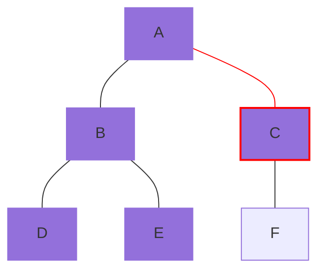

6. **Call DFS(F)**
- Mark node F as visited
- Node F has no unvisited adjacent nodes
- Call Stack: [A, C, F]
- Visited: [A, B, D, E, C, F]
- Processed: [A, B, D, E, C, F]

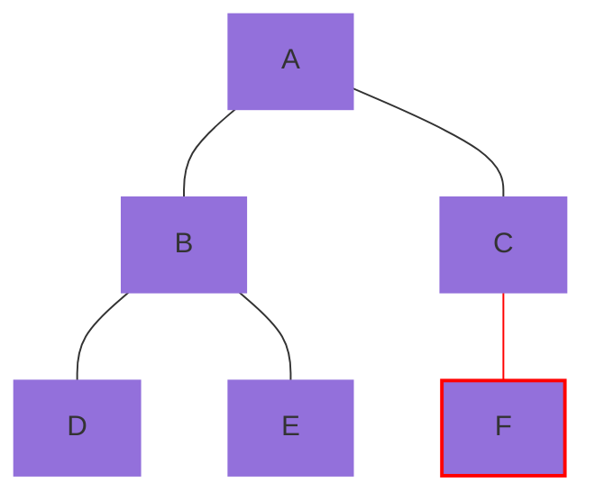

7. **End**
- The DFS traversal order is A -> B -> D -> E -> C -> F.

---

### 2. 간단한 그래프 구조

#### 문제

아래와 같은 그래프에서 DFS 방식을 적용하여 탐색하시오. 탐색은 A 노드에서 시작한다.

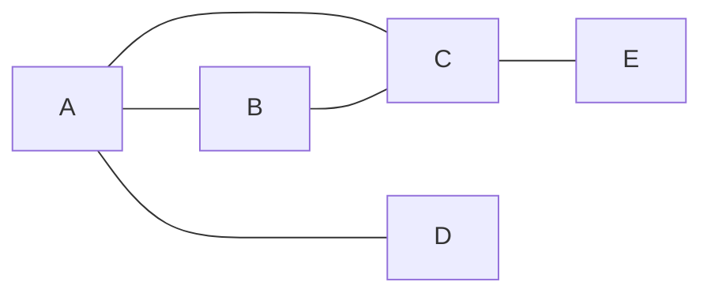

#### 풀이 1. Iterative approach

1. **Initialization**
- Start at node A
- Mark node A as visited.
- Push node A onto the stack.
- Stack: [A]
- Visited: [A]
- Processed: [ ]

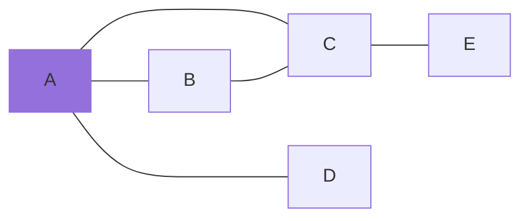

2. **Step 1**
- Pop node A from the stack
- Process(A)
- Push its unvisited adjacent nodes B, C, and D onto the stack (order may vary)
- Mark node B, C, and D as visited
- Stack: [B, C, D]
- Visited: [A, B, C, D]
- Processed: [A]

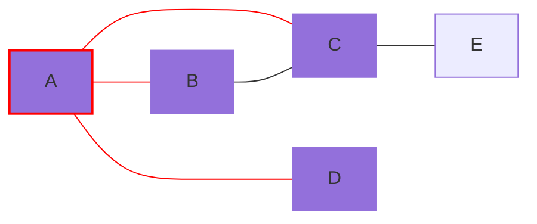

3. **Step 2**
- Pop node D from the stack
- Process(D)
- Node D has no unvisited adjacent nodes to push
- Stack: [B, C]
- Visited: [A, B, C, D]
- Processed: [A, D]

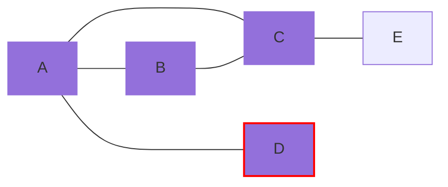

4. **Step 3**
- Pop node C from the stack
- Process(C)
- Push its unvisited adjacent node E onto the stack
- Mark node E as visited
- Stack: [B, E]
- Visited: [A, B, C, D, E]
- Processed: [A, D, C]

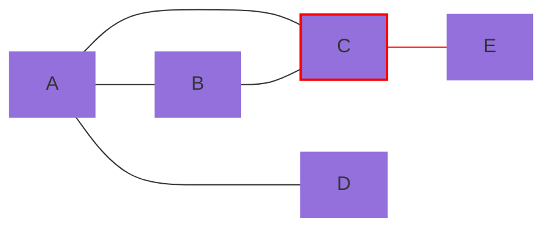

5. **Step 4**
- Pop node E from the stack
- Process(E)
- Node E has no unvisited adjacent nodes to push
- Stack: [B]
- Visited: [A, B, C, D, E]
- Processed: [A, D, C, E]

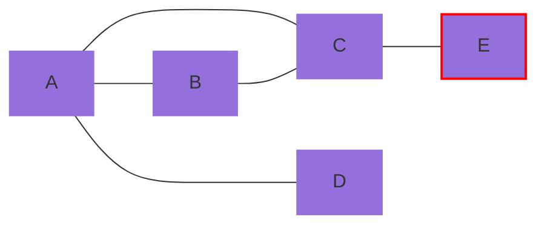

6. **Step 5**
- Pop node B from the stack
- Process(B)
- Node B has no unvisited adjacent nodes to push
- Stack: [ ]
- Visited: [A, B, C, D, E]
- Processed: [A, D, C, E, B]

```mermaid
graph LR
 A---B;
 A---C;
 A----D;
 B---C;
 C---E;
 linkStyle 3 stroke:grey
 style A fill:#9370DB
 style B fill:#9370DB, stroke:red, stroke-width:2px
 style C fill:#9370DB
 style D fill:#9370DB
 style E fill:#9370DB
```

7. **End**
- The DFS traversal order is A -> D -> C -> E -> B.


> We have the different result as the recursive DFS as below because we pushed unvisited adjacent nodes onto the stack in order. Otherwise, the traversal order would be A -> B -> C -> E -> D.
{: .prompt-info}

#### 풀이 2. Recursive approach

1. **Call DFS(A)**
- Start at node A
- Mark node A as visited
- Process(A)
- Visit its adjacent nodes B, C, and D
- Call Stack: [A]
- Visited: [A]
- Processed: [A]

```mermaid
graph LR
 A---B;
 A---C;
 A----D;
 B---C;
 C---E;
 style A fill:#9370DB, stroke:red, stroke-width:2px
```

2. **Call DFS(B)**
- Mark node B as visited
- Process(B)
- Visit its adjacent nodes C and E
- Call Stack: [A, B]
- Visited: [A, B]
- Processed: [A, B]

```mermaid
graph LR
 A---B;
 A---C;
 A----D;
 B---C;
 C---E;
 linkStyle 0 stroke:red
 style A fill:#9370DB
 style B fill:#9370DB, stroke:red, stroke-width:2px
```

3. **Call DFS(C)**
- Mark node C as visited
- Process(C)
- Visit its adjacent node E
- Call Stack: [A, B, C]
- Visited: [A, B, C]
- Processed: [A, B, C]

```mermaid
graph LR
 A---B;
 A---C;
 A----D;
 B---C;
 C---E;
 linkStyle 3 stroke:red
 style A fill:#9370DB
 style B fill:#9370DB
 style C fill:#9370DB, stroke:red, stroke-width:2px
```

4. **Call DFS(E)**
- Mark node E as visited
- Process(E)
- Node E has no unvisited adjacent nodes
- Call Stack: [A, B, C, E]
- Visited: [A, B, C, E]
- Processed: [A, B, C, E]

```mermaid
graph LR
 A---B;
 A---C;
 A----D;
 B---C;
 C---E;
 linkStyle 4 stroke:red
 style A fill:#9370DB
 style B fill:#9370DB
 style C fill:#9370DB
 style E fill:#9370DB, stroke:red, stroke-width:2px
```

5. **Return to DFS(C), DFS(B), and DFS(A); and call DFS(D)**
- Mark node D as visited
- Process(D)
- Node D has no unvisited adjacent nodes
- Call Stack: [A, D]
- Visited: [A, B, C, E, D]
- Processed: [A, B, C, E, D]

```mermaid
graph LR
 A---B;
 A---C;
 A----D;
 B---C;
 C---E;
 linkStyle 2 stroke:red
 style A fill:#9370DB
 style B fill:#9370DB
 style C fill:#9370DB
 style E fill:#9370DB
 style D fill:#9370DB, stroke:red, stroke-width:2px
```

6. **End**
- The DFS traversal order is A -> B -> C -> E -> D.