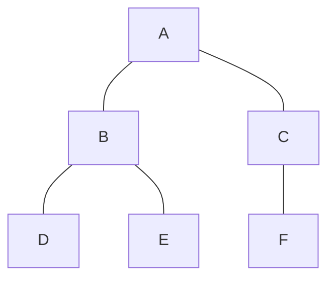
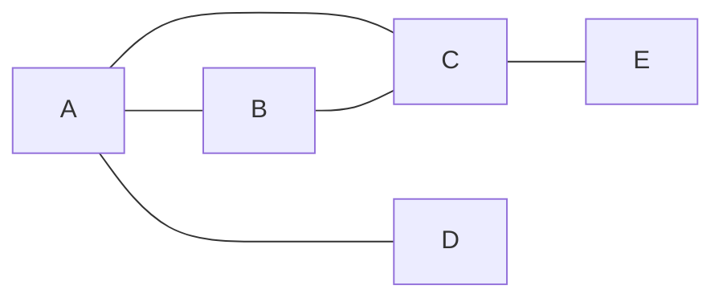

깊이 우선 탐색 알고리즘을 정리한다.

---

## 정의

DFS is an algorithm for traversing or searching a tree or graph. Starting from the root (or an arbitrary node in the case of a graph), it explores as far as possible along each branch before backtracking.

---

## 주요 특징

### **1. Traversal Method**

- DFS uses a LIFO (Last in, First Out) structure, typically implemented with **a stack**, either explicitly (using **a stack data structure**) or implicitly (via **recursion**).

### **2. Exploration Strategy**

- It explores nodes and branches to the maximum depth of the structure before backtacking.

### **3. Graph Types**

- It can be used for both directed and undirected graphs.

---

## 알고리즘 단계

### DFS (by iteration using an explicit stack)

1. **Start** at the root node (or any arbitrary node in the case of a graph).
2. **Initialize a stack** and **push** the starting node onto the stack.
3. If the stack is **not empty**:
	1. **Pop** the top node from the stack, which is the current node.
4. If the current node **has not been visited**:
	1. **Mark** the current node as visited.
	2. **Push** all unvisited adjacent nodes of the current node onto the stack.
9. **Repeat** step 2 until all nodes are visited.


> **Iterative DFS** uses a stack to manage the nodes to be visited, explicitly handling the backtracking process by pushing and popping nodes.
{: .prompt-info}


### DFS (by recursion using a call stack)

1. **Start** at the root node (or any arbitrary node in the case of a graph).
2.  If the current node **has not been visited**:
	1. **Mark** the current node as visited.
	2. **Recursively visit** all unvisited adjacent nodes of the current node.


> **Recursive DFS** uses the call stack of the programming language to manage the nodes to be visited, implicitly handling the backtracking process through recursive function calls.
{: .prompt-info}

---

## 유사코드

### 반복문(Iterative)

```python
DFS(graph, start):
    create a stack S
    push start onto S
    while S is not empty:
        current = S.pop()
        if current is not visited:
            mark current as visited
            for each neighbor of current:
                if neighbor is not visited:
                    push neighbor onto S	
```

### 재귀법(Recursive)

```python
DFS(graph, node):
    if node is not visited:
        mark node as visited
        for each neighbor of node:
            if neighbor is not visited:
                DFS(graph, neighbor)
```

---

## 예제

### 1. 간단한 트리 구조

#### 문제

아래와 같은 트리에서 DFS 방식을 적용하여 탐색하시오. 탐색은 A 노드에서 시작한다.



#### 풀이 1. Iterative approach

1. **Initialization**
- Start at node A
- Initialize a stack and push node A onto the stack
- Stack: [A]
- Visit-info: { }

2. **Step 1**
- Pop node A from the stack
- Mark node A as visited
- Push its unvisited adjacent nodes B and C onto the stack (order may vary)
- Stack: [C, B]
- Visit-info: {A}

3. **Step 2**
- Pop node B from the stack
- Mark node B as visited
- Push its unvisited adjacent nodes D and E onto the stack (order may vary)
- Stack: [C, E, D]
- Visit-info: {A, B}

4. **Step 3**
- Pop node D from the stack
- Mark node D as visited
- Node D has no unvisited adjacent nodes to push
- Stack: [C, E]
- Visit-info: {A, B, D}

5. **Step 4**
- Pop node E from the stack
- Mark node E as visited
- Node E has no unvisited adjacent nodes to push
- Stack: [C]
- Visit-info: {A, B, D, E}

6. **Step 5**
- Pop node C from the stack
- Mark node C as visited
- Push its unvisited adjacent node F onto the stack
- Stack: [F]
- Visit-info: {A, B, D, E, C}

7. **Step 6**
- Pop node F from the stack
- Mark node F as visited
- Node F has no unvisited adjacent nodes to push
- Stack: [ ]
- Visit-info: {A, B, D, E, C, F}

8. **End**
- The DFS traversal order is A -> B -> D -> E -> C -> F.

> We have the same result as the recursive DFS as below because we pushed unvisited adjacent nodes onto the stack in reverse order.
{: .prompt-info}

#### 풀이 2. Recursive approach

1. **Call DFS(A)**
- Start at node A
- Mark node A as visited
- Visit its adjacent nodes B and C
- Call Stack: [A]
- Visit-info: {A}

2. **Call DFS(B)**
- Mark node B as visited
- Visit its adjacent nodes D and E
- Call Stack: [A, B]
- Visit-info: {A, B}

3. **Call DFS(D)**
- Mark node D as visited
- Node D has no unvisited adjacent nodes
- Call Stack: [A, B, D]
- Visit-info: {A, B, D}

4. **Return to DFS(B) and call DFS(E)**
- Mark node E as visited
- Node E has no unvisited adjacent nodes
- Call Stack: [A, B, E]
- Visit-info: {A, B, D, E}

5. **Return to DFS(B) and DFS(A); and call DFS(C)**
- Mark node C as visited
- Visit its adjacent node F
- Call Stack: [A, C]
- Visit-info: {A, B, D, E, C}

6. **Call DFS(F)**
- Mark node F as visited
- Node F has no unvisited adjacent nodes
- Call Stack: [A, C, F]
- Visit-info: {A, B, D, E, C, F}

7. **End**
- The DFS traversal order is A -> B -> D -> E -> C -> F.

---

### 2. 간단한 그래프 구조

#### 문제

아래와 같은 그래프에서 DFS 방식을 적용하여 탐색하시오. 탐색은 A 노드에서 시작한다.



#### 풀이 1. Iterative approach

1. **Initialization**
- Start at node A
- Initialize a stack and push node A onto the stack
- Stack: [A]
- Visit-info: { }

2. **Step 1**
- Pop node A from the stack
- Mark node A as visited
- Push its unvisited adjacent nodes B, C, and D onto the stack (order may vary)
- Stack: [B, C, D]
- Visit-info: {A}

3. **Step 2**
- Pop node D from the stack
- Mark node D as visited
- Node D has no unvisited adjacent nodes to push
- Stack: [B, C]
- Visit-info: {A, D}

4. **Step 3**
- Pop node C from the stack
- Mark node C as visited
- Push its unvisited adjacent node E onto the stack
- Stack: [B, E]
- Visit-info: {A, D, C}

5. **Step 4**
- Pop node E from the stack
- Mark node E as visited
- Node E has no unvisited adjacent nodes to push
- Stack: [B]
- Visit-info: {A, D, C, E}

6. **Step 5**
- Pop node B from the stack
- Mark node B as visited
- Node B has no unvisited adjacent nodes to push
- Stack: [ ]
- Visit-info: {A, D, C, E, B}

7. **End**
- The DFS traversal order is A -> D -> C -> E -> B.


> We have the different result as the recursive DFS as below because we pushed unvisited adjacent nodes onto the stack in order.
{: .prompt-info}

#### 풀이 2. Recursive approach

1. **Call DFS(A)**
- Start at node A
- Mark node A as visited
- Visit its adjacent nodes B, C, and D
- Call Stack: [A]
- Visit-info: {A}

2. **Call DFS(B)**
- Mark node B as visited
- Visit its adjacent nodes C and E
- Call Stack: [A, B]
- Visit-info: {A, B}

3. **Call DFS(C)**
- Mark node C as visited
- Visit its adjacent node E
- Call Stack: [A, B, C]
- Visit-info: {A, B, C}

4. **Call DFS(E)**
- Mark node E as visited
- Node E has no unvisited adjacent nodes
- Call Stack: [A, B, C, E]
- Visit-info: {A, B, C, E}

5. **Return to DFS(C), DFS(B), and DFS(A); and call DFS(D)**
- Mark node D as visited
- Node D has no unvisited adjacent nodes
- Call Stack: [A, D]
- Visit-info: {A, B, C, E, D}

6. **End**
- The DFS traversal order is A -> B -> C -> E -> D.