## 개요

너비 우선 탐색(BFS, Breadth First Search)은 트리 구조 또는 그래프 탐색 방법중 하나입니다. 트리 구조의 루트 노드에서 시작하여 (그래프의 경우 임의의 노드에서 시작하여) **모든 인접 노드를 먼저 탐색**한 후, 그 다음 인접 노드를 탐색하는 방식으로 진행하는 알고리즘입니다.

---

## 목적

트리 구조 또는 그래프의 모든 노드를 방문하는 데 초점이 맞춰져 있습니다.

---

## 주요 특징

### 탐색 방법

- BFS는 FIFO (First in, First Out) 구조인 **큐**를 사용하여 탐색 경로를 관리합니다.
- [반복적 방식(iterative)](#iterative-bfs)의 구현이 일반적입니다.

### 탐색 전략

- 시작 노드에서 가까운 노드부터 먼 노드 (레벨) 순서대로 노드를 탐색합니다.

### 사용 예시

- 트리 구조 또는 그래프의 모든 노드를 방문
- 최단 경로 찾기: 무가중치 그래프에서 출발점에서 목적지까지의 최단 경로 찾기
- 레벨 순서 탐색: 그래프의 각 노드를 레벨별로 방문하기
- 이분 그래프 검사: 그래프가 이분 그래프인지 확인하기(두 개의 그룹으로 나눌 수 있는지 여부)
- 최소 신장 트리: 무가중치 그래프에서 모든 노드를 포함하는 최소 신장 트리 찾기
- 웹 크롤링: 인터넷의 웹 페이지를 순차적으로 탐색하기
- 최단 전파 시간: 네트워크에서 메시지 전파 시간이 가장 짧은 경로 찾기

---

## 알고리즘

### Iterative BFS

1. **Initialization**
	1. **Start** at the root node (or any arbitrary node in the case of a graph).
	2. **Mark** the starting node as visited.
	3. **Enqueue** the starting node into the queue.
2. **Exploration**:
	1. If the queue is **not empty**:
		1. **Dequeue** a node from the queue, which is the current node.
	2. For each **unvisited adjacent nodes** of the current node:
		1. **Mark** the adjacent node as visited.
		2. **Enqueue** the adjacent node into the queue.
3. **Termination**: **Repeat** step 2 until all nodes are visited.


> Nodes are marked as visited before enqueuing, ensuring they are not enqueued more than once. This approach uses a queue for the BFS and a set to keep track of visited nodes.
{: .prompt-info}

---

## 의사 코드

```python
BFS(graph, start):
    create a queue Q
    mark start as visited
    enqueue start into S
    while Q is not empty:
        current = Q.dequeue()
        // You can add your processing code here
        for each neighbor of current:
            if neighbor is not visited:
                mark neighbor as visited
                enqueue neighbor into Q
```

---

## 예제

아래와 같이 두 가지 문제를 풀어본다.

1. [간단한 트리 구조](#1-간단한-트리-구조)\
    1.1. [문제](#11-문제)\
    1.2. [풀이(iterative)](#12-풀이iterative-approach)
2. [간단한 그래프](#2-간단한-그래프)\
    2.1. [문제](#21-문제)\
    2.2. [풀이(iterative)](#22-풀이iterative-approach)

### 1. 간단한 트리 구조

#### 1.1. 문제

아래와 같은 트리에서 BFS 방식을 적용하여 탐색하시오. 탐색은 A 노드에서 시작한다.

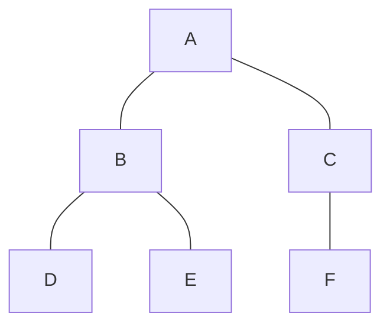

#### 1.2. 풀이(iterative approach)

1. **Initialization**
- Start at node A
- Mark node A as visited
- Initialize a queue and enqueue node A into the queue
- Queue: [A]
- Visited: [A]
- Processed: [ ]

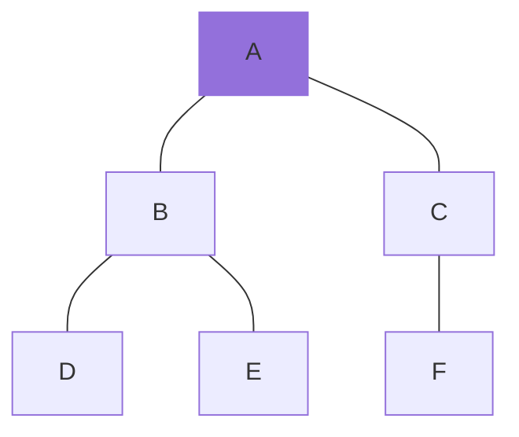

2. **Step 1**
- Dequeue node A from the queue
- Process(A)
- Enqueue its unvisited adjacent nodes B and C into the queue (order may vary), marking them as visited
- Queue: [B, C]
- Visited: [A, B, C]
- Processed: [A]

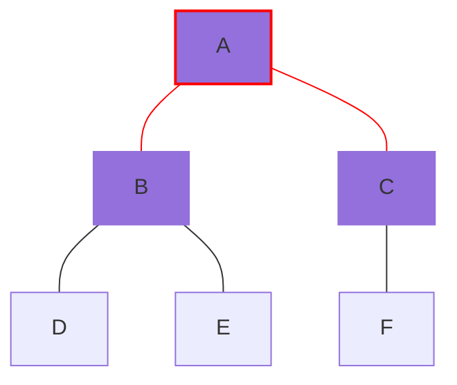

3. **Step 2**
- Dequeue node B from the queue
- Process(B)
- Enqueue its unvisited adjacent nodes D and E into the queue (order may vary), marking them as visited
- Queue: [C, D, E]
- Visited: [A, B, C, D, E]
- Processed: [A, B]


4. **Step 3**
- Dequeue node C from the queue
- Process(C)
- Enqueue its unvisited adjacent node F into the queue, marking it as visited.
- Queue: [D, E, F]
- Visited: [A, B, C, D, E, F]
- Processed: [A, B, C]


5. **Step 4**
- Dequeue node D from the queue
- Process(D)
- Node D has no unvisited adjacent nodes to enqueue
- Queue: [E, F]
- Visited: [A, B, C, D, E, F]
- Processed: [A, B, C, D]

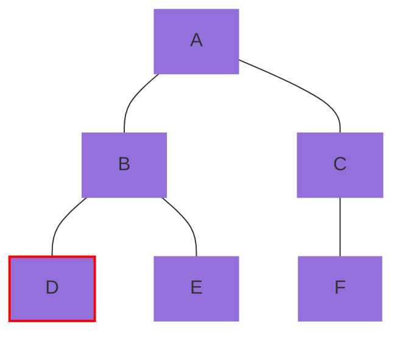

6. **Step 5**
- Dequeue node E from the queue
- Process(E)
- Node E has no unvisited adjacent nodes to enqueue
- Queue: [F]
- Visited: [A, B, C, D, E, F]
- Processed: [A, B, C, D, E]

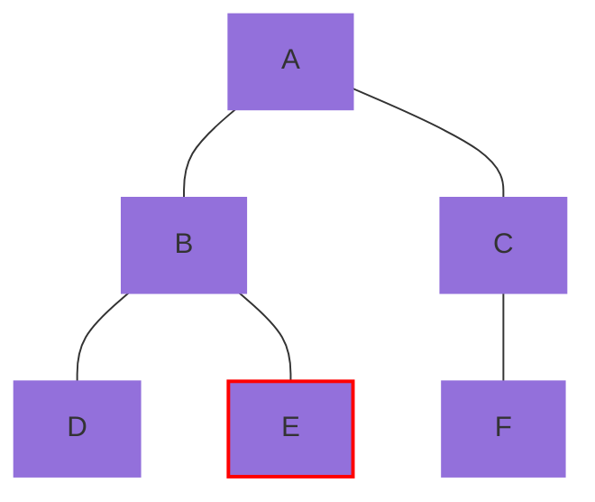

7. **Step 6**
- Dequeue node F from the queue
- Process(F)
- Node F has no unvisited adjacent nodes to enqueue
- Queue: [ ]
- Visited: [A, B, C, D, E, F]
- Processed: [A, B, C, D, E, F]

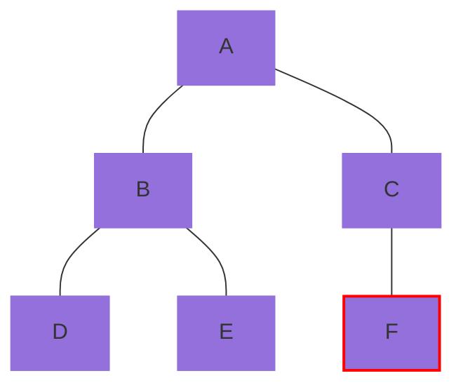

8. **End**
- The BFS traversal order is A &rarr; B &rarr; C &rarr; D &rarr; E &rarr; F.

### 2. 간단한 그래프

#### 2.1. 문제

아래와 같은 그래프에서 BFS 방식을 적용하여 탐색하시오. 탐색은 A 노드에서 시작한다.

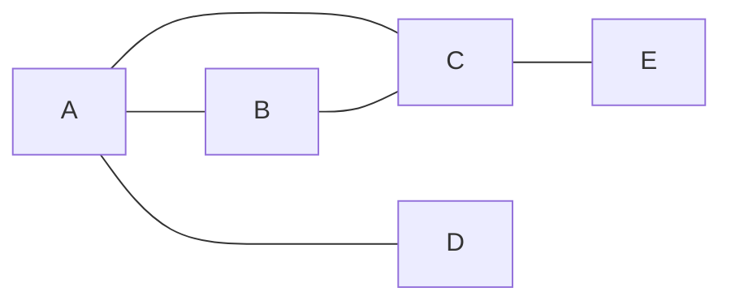

#### 2.2. 풀이(iterative approach)

1. **Initialization**
- Start at node A
- Mark node A as visited
- Initialize a queue and enqueue node A into the queue
- Queue: [A]
- Visited: [A]
- Processed: [ ]

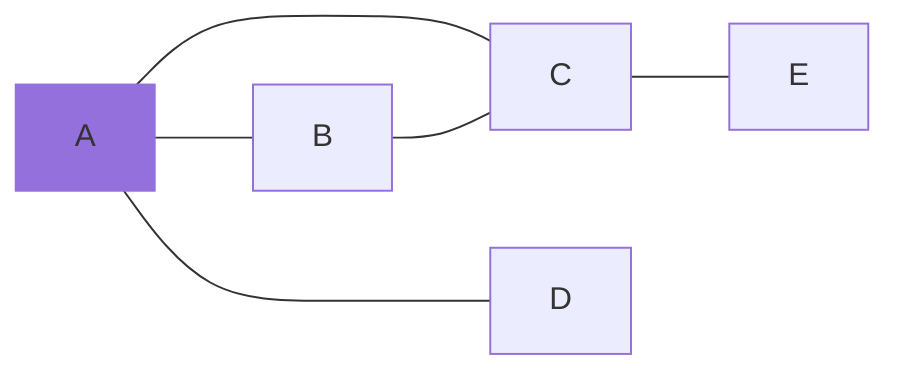

2. **Step 1**
- Dequeue node A from the queue
- Process(A)
- Enqueue its unvisited adjacent nodes B, C, and D into the queue (order may vary), marking them as visited
- Queue: [B, C, D]
- Visited: [A, B, C, D]
- Processed: [A]

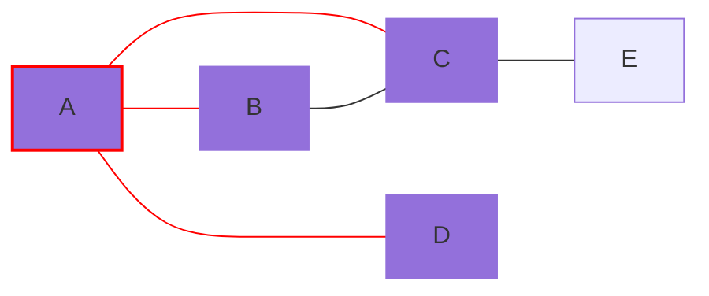

3. **Step 2**
- Dequeue node B from the queue
- Process(B)
- Node B has no unvisited adjacent nodes to enqueue
- Queue: [C, D]
- Visited: [A, B, C, D]
- Processed: [A, B]

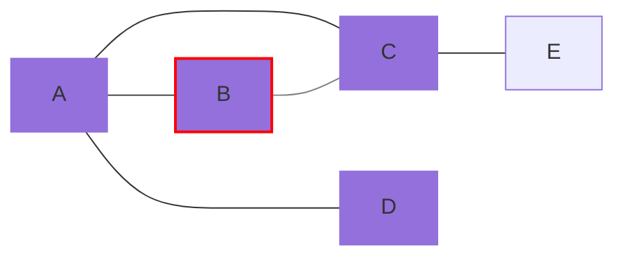

4. **Step 3**
- Dequeue node C from the queue
- Process(C)
- Enqueue its unvisited adjacent node E into the queue, marking it as visited.
- Queue: [D, E]
- Visited: [A, B, C, D, E]
- Processed: [A, B, C]

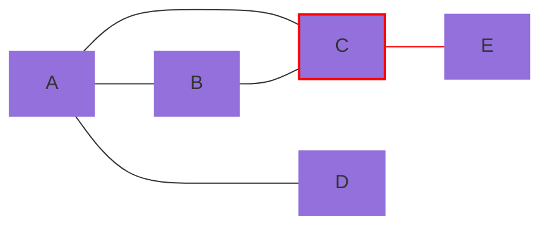

5. **Step 4**
- Dequeue node D from the queue
- Process(D)
- Node D has no unvisited adjacent nodes to enqueue
- Queue: [E]
- Visited: [A, B, C, D, E]
- Processed: [A, B, C, D]


6. **Step 5**
- Dequeue node E from the queue
- Process(E)
- Node E has no unvisited adjacent nodes to enqueue
- Queue: [ ]
- Visited: [A, B, C, D, E]
- Processed: [A, B, C, D, E]

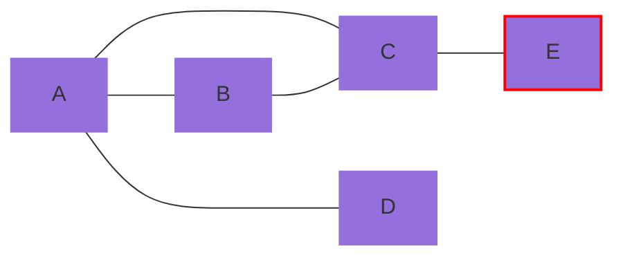

7. **End**
- The BFS traversal order is A &rarr; B &rarr; C &rarr; D &rarr; E.