너비 우선 탐색 알고리즘을 정리한다.

---

## 정의

BFS is an algorithm for traversing or searching a tree or graph. Starting form the root (or an arbitrary node in the case of a graph), it explores all the neighbor nodes at the present depth prior to moving on nodes at the next depth level.

---

## 주요 특징

### **1. Traversal Method**

- BFS uses a FIFO (First in, First Out) structure, typically implemented with **a queue**.

### **2. Exploration Strategy**

- It explores nodes level by level, visiting all neighbors at the current depth before moving to the next depth level.

### **3. Graph Types**

- It can be used for both directed and undirected graphs.

---

## 알고리즘 단계

### BFS 

1. **Initialization**
	1. **Start** at the root node (or any arbitrary node in the case of a graph).
	2. **Mark** the starting node as visited.
	3. **Enqueue** the starting node into the queue.
2. **Exploration**:
	1. If the queue is **not empty**:
		1. **Dequeue** a node from the queue, which is the current node.
	2. For each **unvisited adjacent nodes** of the current node:
		1. **Mark** the adjacent node as visited.
		2. **Enqueue** the adjacent node into the queue.
3. **Termination**: **Repeat** step 2 until all nodes are visited.


> Nodes are marked as visited before enqueuing, ensuring they are not enqueued more than once. This approach uses a queue for the BFS and a set to keep track of visited nodes.
{: .prompt-info}

---

## 유사코드

### 반복문(Iterative)

```python
BFS(graph, start):
    create a queue Q
    mark start as visited
    enqueue start into S
    while Q is not empty:
        current = Q.dequeue()
        // You can add your processing code here
        for each neighbor of current:
            if neighbor is not visited:
                mark neighbor as visited
                enqueue neighbor into Q
```

---

## 예제

### 1. 간단한 트리 구조

#### 문제

아래와 같은 트리에서 BFS 방식을 적용하여 탐색하시오. 탐색은 A 노드에서 시작한다.

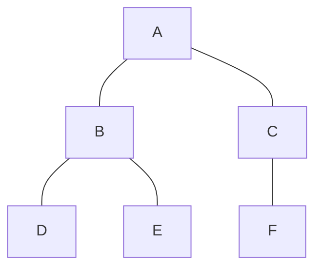

#### 풀이. Iterative approach

1. **Initialization**
- Start at node A
- Mark node A as visited
- Initialize a queue and enqueue node A into the queue
- Queue: [A]
- Visit-info: {A}

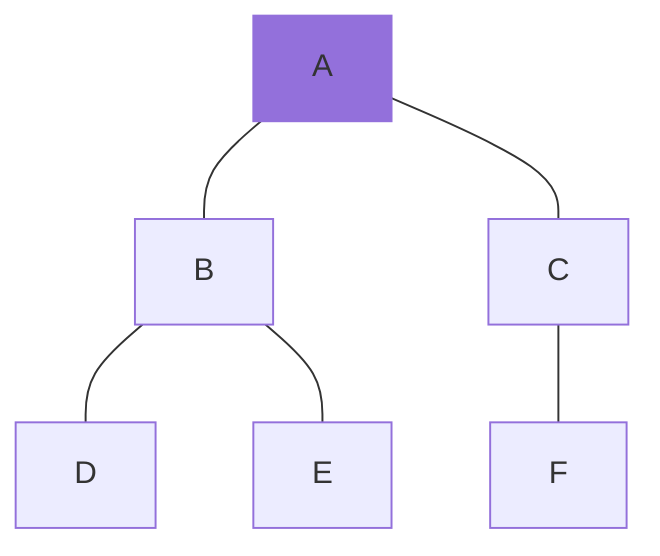

2. **Step 1**
- Dequeue node A from the queue
- Process(A)
- Enqueue its unvisited adjacent nodes B and C into the queue (order may vary), marking them as visited
- Queue: [B, C]
- Visit-info: {A, B, C}

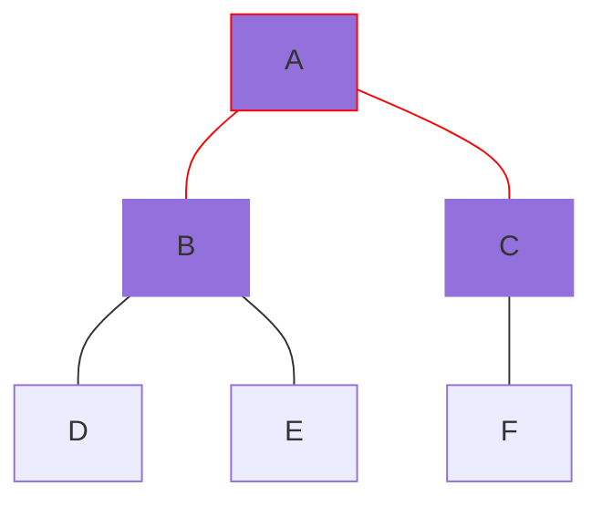

3. **Step 2**
- Dequeue node B from the queue
- Process(B)
- Enqueue its unvisited adjacent nodes D and E into the queue (order may vary), marking them as visited
- Queue: [C, D, E]
- Visit-info: {A, B, C, D, E}

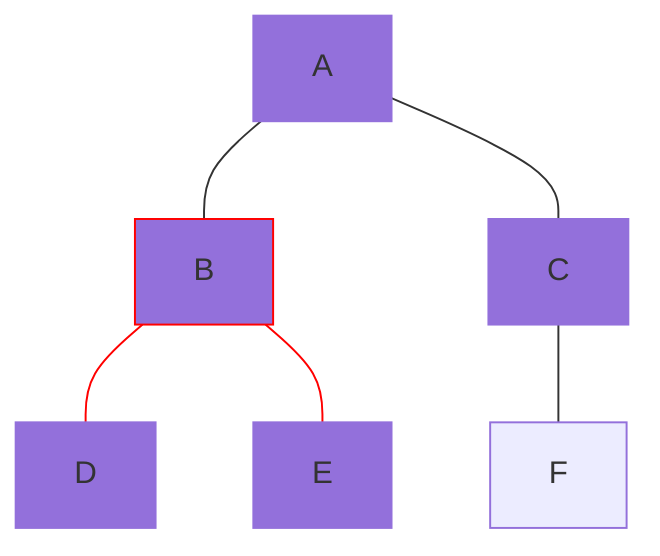

4. **Step 3**
- Dequeue node C from the queue
- Process(C)
- Enqueue its unvisited adjacent node F into the queue, marking it as visited.
- Queue: [D, E, F]
- Visit-info: {A, B, C, D, E, F}

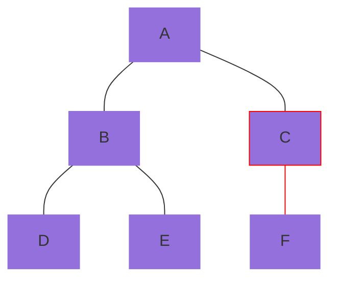

5. **Step 4**
- Dequeue node D from the queue
- Process(D)
- Node D has no unvisited adjacent nodes to enqueue
- Queue: [E, F]
- Visit-info: {A, B, C, D, E, F}

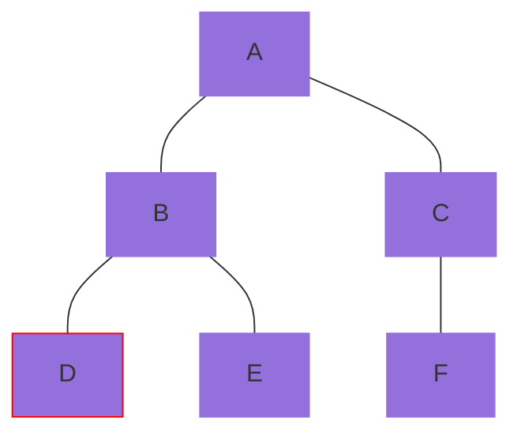

6. **Step 5**
- Dequeue node E from the queue
- Process(E)
- Node E has no unvisited adjacent nodes to enqueue
- Queue: [F]
- Visit-info: {A, B, C, D, E, F}

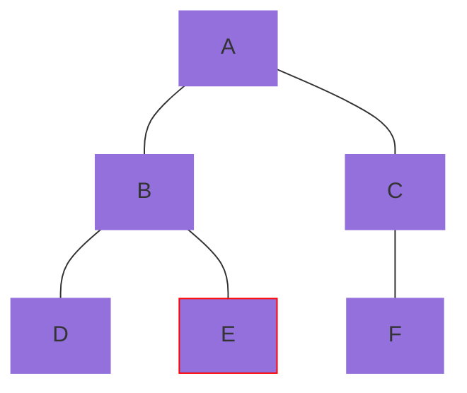

7. **Step 6**
- Dequeue node F from the queue
- Process(F)
- Node F has no unvisited adjacent nodes to enqueue
- Queue: [ ]
- Visit-info: {A, B, C, D, E, F}

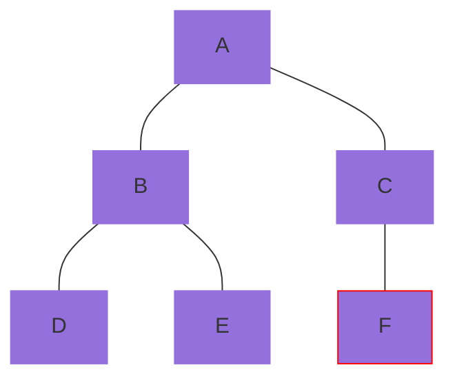

8. **End**
- The BFS traversal order is A -> B -> C -> D -> E -> F.

### 2. 간단한 그래프 구조

#### 문제

아래와 같은 그래프에서 BFS 방식을 적용하여 탐색하시오. 탐색은 A 노드에서 시작한다.

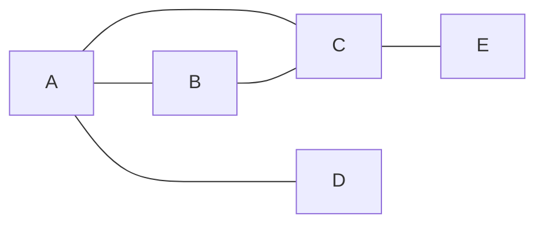

#### 풀이. Iterative approach

1. **Initialization**
- Start at node A
- Mark node A as visited
- Initialize a queue and enqueue node A into the queue
- Queue: [A]
- Visit-info: {A}

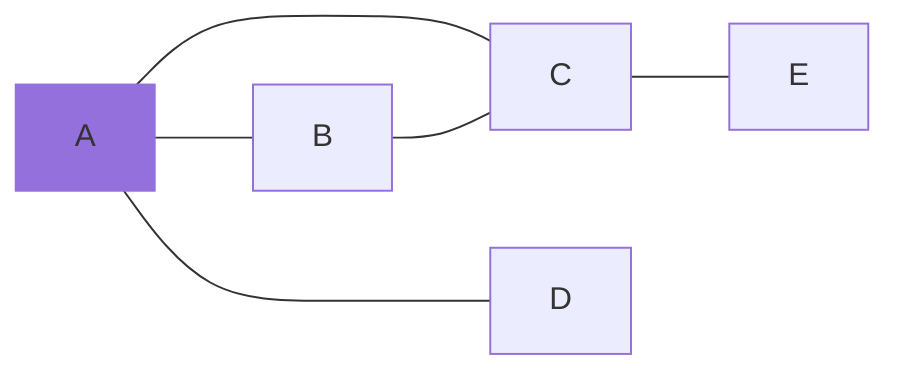

2. **Step 1**
- Dequeue node A from the queue
- Process(A)
- Enqueue its unvisited adjacent nodes B, C, and D into the queue (order may vary), marking them as visited
- Queue: [B, C, D]
- Visit-info: {A, B, C, D}


3. **Step 2**
- Dequeue node B from the queue
- Process(B)
- Node B has no unvisited adjacent nodes to enqueue
- Queue: [C, D]
- Visit-info: {A, B, C, D}

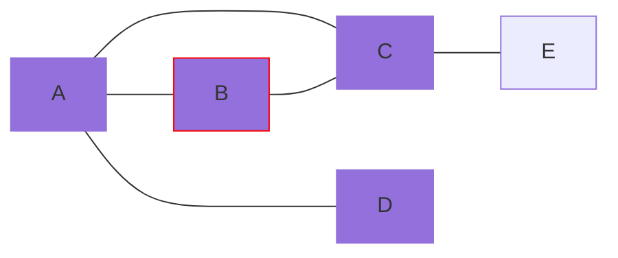

4. **Step 3**
- Dequeue node C from the queue
- Process(C)
- Enqueue its unvisited adjacent node E into the queue, marking it as visited.
- Queue: [D, E]
- Visit-info: {A, B, C, D, E}

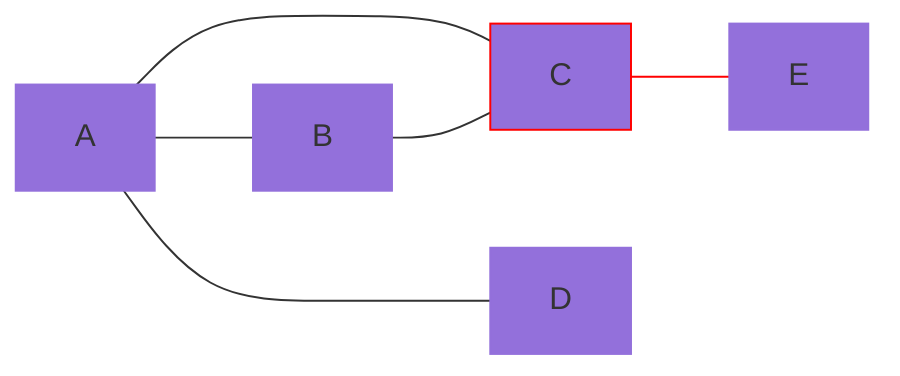

5. **Step 4**
- Dequeue node D from the queue
- Process(D)
- Node D has no unvisited adjacent nodes to enqueue
- Queue: [E]
- Visit-info: {A, B, C, D, E}

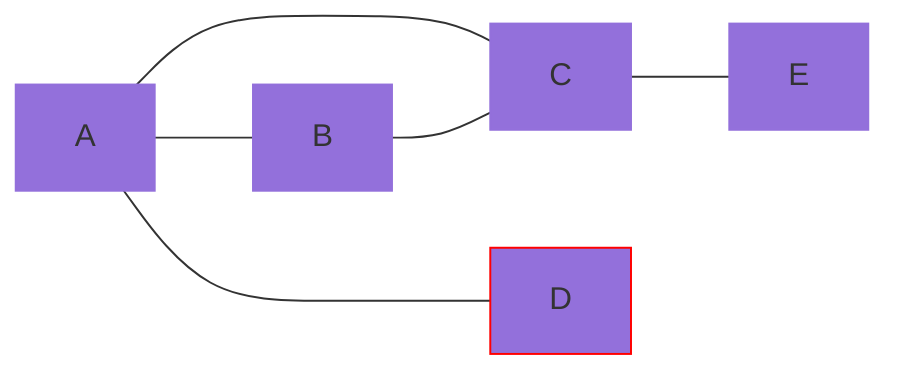

6. **Step 5**
- Dequeue node E from the queue
- Process(E)
- Node E has no unvisited adjacent nodes to enqueue
- Queue: [ ]
- Visit-info: {A, B, C, D, E}

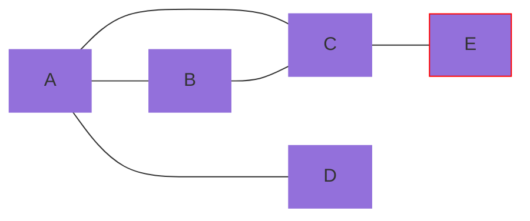

7. **End**
- The BFS traversal order is A -> B -> C -> D -> E.