## 개요

너비 우선 탐색(BFS, Breadth First Search)은 트리 구조 또는 그래프 탐색 방법 중 하나입니다. 탐색 순서를 간단히 알아봅시다. 첫 번째로 탐색할 노드는 어떤 구조인지에 따라 달라집니다. 트리 구조는 루트 노드에서 시작하고, 그래프는 임의의 노드에서 시작합니다. 그리고 현재 노드의 **모든 주변 노드를 탐색합니다.** 그 다음 주변 노드 중 한 노드를 기준으로 방문하지 않은 주변 노드를 탐색합니다. 너비 우선 탐색은 이런 탐색 방식을 반복 진행하며 모든 노드를 방문하는 알고리즘입니다.

---

## 목적

트리 구조 또는 그래프의 모든 노드를 방문한다.

---

## 주요 특징

### 탐색 방법

- FIFO (First in, First Out) 구조인 <kbd>큐(Queue)</kbd>를 사용하여 탐색 경로를 관리한다.
- [반복적 방식(iterative)](#iterative-bfs)으로 구현하는 것이 일반적이다.

### 탐색 전략

- 시작 노드에서 가까운 노드부터 먼 노드(레벨) 순서대로 노드를 탐색한다.

### 사용 예시

- 트리 구조 또는 그래프의 <mark>모든 노드 방문하기</mark>
- <mark>최단 경로 찾기</mark>: 무가중치 그래프에서 출발점에서 목적지까지의 최단 경로 찾기
- <mark>레벨 순서 탐색</mark>: 그래프의 각 노드를 레벨별로 방문하기
- <mark>이분 그래프 검사</mark>: 그래프가 이분 그래프인지 확인하기(두 개의 그룹으로 나눌 수 있는지 여부)
- <mark>최소 신장 트리</mark>: 무가중치 그래프에서 모든 노드를 포함하는 최소 신장 트리 찾기
- <mark>웹 크롤링</mark>: 인터넷의 웹 페이지를 순차적으로 탐색하기
- <mark>최단 전파 시간</mark>: 네트워크에서 메시지 전파 시간이 가장 짧은 경로 찾기

---

## 알고리즘

### 반복적 구현법(Iterative BFS)

1. **Initialization**
	1. **Start** at the root node (or any arbitrary node in the case of a graph).
	2. **Mark** the starting node as visited.
	3. **Enqueue** the starting node into the queue.
2. **Exploration**
	1. If the queue is **not empty**:
		1. **Dequeue** a node from the queue, which is the current node.
	2. For each **unvisited adjacent nodes** of the current node:
		1. **Mark** the adjacent node as visited.
		2. **Enqueue** the adjacent node into the queue.
3. **Termination**
   1. **Repeat** step 2 (exploration) until all nodes are visited.


> 노드를 큐에 넣기 전에 방문 표기를 해야 한다. 이렇게 해서 동일한 노드를 두 번 이상 큐에 넣지 않도록 한다. 이 방법은 BFS 알고리즘을 구현하기 위해 **큐(queue)**를 사용하고, 방문한 노드를 추적하기 위해 **집합(set)**을 사용한다.
{: .prompt-info}

---

## 의사 코드(pseudo-code)

```python
BFS(graph, start):
    create a queue Q
    mark start as visited
    enqueue start into S
    while Q is not empty:
        current = Q.dequeue()
        // You can add your processing code here
        for each neighbor of current:
            if neighbor is not visited:
                mark neighbor as visited
                enqueue neighbor into Q
```

---

## 예제

아래와 같이 두 가지 문제를 풀어본다.

1. [간단한 트리 구조](#1-간단한-트리-구조)\
    1.1. [문제](#11-문제)\
    1.2. [풀이(iterative)](#12-풀이iterative-approach)
2. [간단한 그래프](#2-간단한-그래프)\
    2.1. [문제](#21-문제)\
    2.2. [풀이(iterative)](#22-풀이iterative-approach)

### 1. 간단한 트리 구조

#### 1.1. 문제

아래와 같은 트리에서 BFS 방식을 적용하여 탐색하시오. 탐색은 A 노드에서 시작한다.

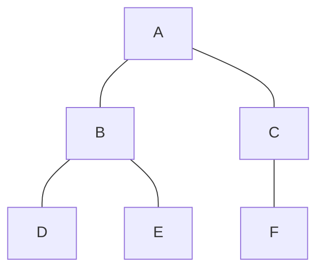
```mermaid
graph TD
 A---B;
 A---C;
 B---D;
 B---E;
 C---F;
```

#### 1.2. 풀이(iterative approach)

1. **Initialization**
- Start at node A
- Mark node A as visited
- Initialize a queue and enqueue node A into the queue
- Queue: [<mark><kbd>A</kbd></mark>]
- Visited: [<mark><kbd>A</kbd></mark>]
- Processed: [ ]

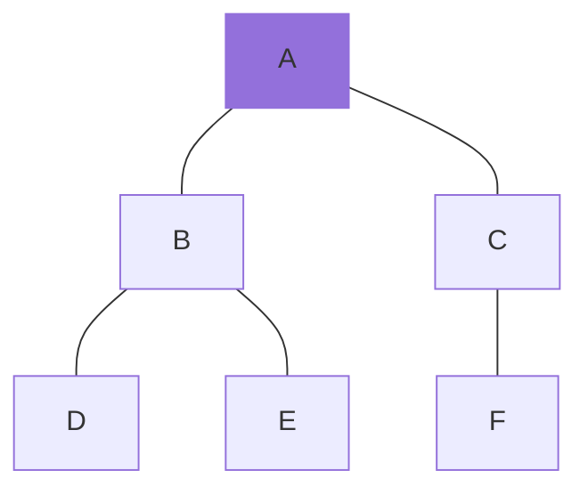
```mermaid
graph TD
 A---B;
 A---C;
 B---D;
 B---E;
 C---F;
 style A fill:#9370DB
```

1. **Step 1**
- Dequeue node A from the queue
- Process(A)
- Enqueue its unvisited adjacent nodes B and C into the queue (order may vary), marking them as visited
- Queue: [~~A~~][<mark><kbd>B</kbd>, <kbd>C</kbd></mark>]
- Visited: [<kbd>A</kbd>, <mark><kbd>B</kbd>, <kbd>C</kbd></mark>]
- Processed: <mark>[<kbd>A</kbd></mark>]

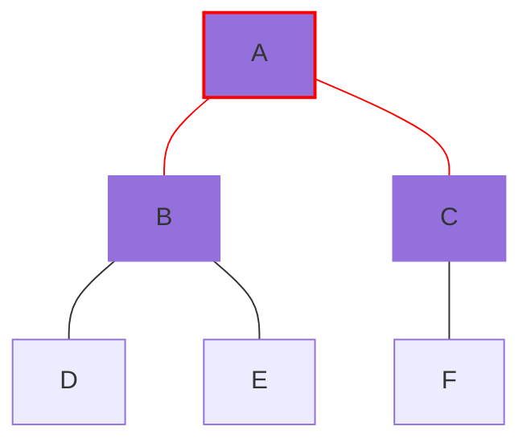
```mermaid
graph TD
 A---B;
 A---C;
 B---D;
 B---E;
 C---F;
 linkStyle 0,1 stroke:red
 style A fill:#9370DB, stroke:red, stroke-width:2px
 style B fill:#9370DB
 style C fill:#9370DB
```

3. **Step 2**
- Dequeue node B from the queue
- Process(B)
- Enqueue its unvisited adjacent nodes D and E into the queue (order may vary), marking them as visited
- Queue: [~~B~~][<kbd>C</kbd>, <mark><kbd>D</kbd>, <kbd>E</kbd></mark>]
- Visited: [<kbd>A</kbd>, <kbd>B</kbd>, <kbd>C</kbd>, <mark><kbd>D</kbd>, <kbd>E</kbd></mark>]
- Processed: [<kbd>A</kbd>, <mark><kbd>B</kbd></mark>]

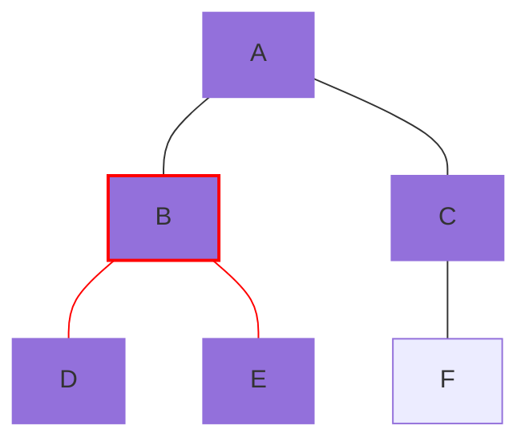
```mermaid
graph TD
 A---B;
 A---C;
 B---D;
 B---E;
 C---F;
 linkStyle 2,3 stroke:red
 style A fill:#9370DB
 style B fill:#9370DB, stroke:red, stroke-width:2px
 style C fill:#9370DB
 style D fill:#9370DB
 style E fill:#9370DB
```

4. **Step 3**
- Dequeue node C from the queue
- Process(C)
- Enqueue its unvisited adjacent node F into the queue, marking it as visited.
- Queue: [~~C~~][<kbd>D</kbd>, <kbd>E</kbd>, <mark><kbd>F</kbd></mark>]
- Visited: [<kbd>A</kbd>, <kbd>B</kbd>, <kbd>C</kbd>, <kbd>D</kbd>, <kbd>E</kbd>, <mark><kbd>F</kbd></mark>]
- Processed: [<kbd>A</kbd>, <kbd>B</kbd>, <mark><kbd>C</kbd></mark>]

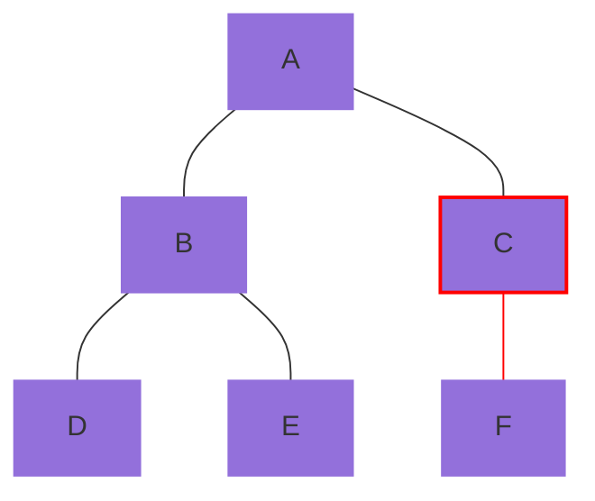
```mermaid
graph TD
 A---B;
 A---C;
 B---D;
 B---E;
 C---F;
 linkStyle 4 stroke:red
 style A fill:#9370DB
 style B fill:#9370DB
 style C fill:#9370DB, stroke:red, stroke-width:2px
 style D fill:#9370DB
 style E fill:#9370DB
 style F fill:#9370DB
```

5. **Step 4**
- Dequeue node D from the queue
- Process(D)
- Node D has no unvisited adjacent nodes to enqueue
- Queue: [~~D~~][<kbd>E</kbd>, <kbd>F</kbd>]
- Visited: [<kbd>A</kbd>, <kbd>B</kbd>, <kbd>C</kbd>, <kbd>D</kbd>, <kbd>E</kbd>, <kbd>F</kbd>]
- Processed: [<kbd>A</kbd>, <kbd>B</kbd>, <kbd>C</kbd>, <mark><kbd>D</kbd></mark>]

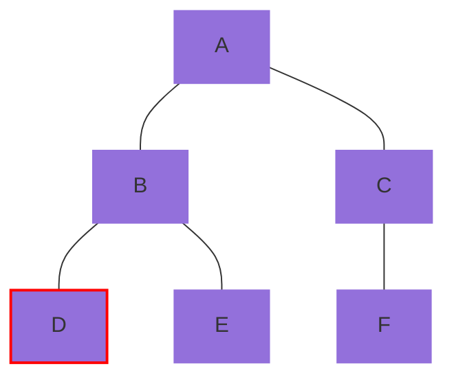
```mermaid
graph TD
 A---B;
 A---C;
 B---D;
 B---E;
 C---F;
 style A fill:#9370DB
 style B fill:#9370DB
 style C fill:#9370DB
 style D fill:#9370DB, stroke:red, stroke-width:2px
 style E fill:#9370DB
 style F fill:#9370DB
```

6. **Step 5**
- Dequeue node E from the queue
- Process(E)
- Node E has no unvisited adjacent nodes to enqueue
- Queue: [~~E~~][<kbd>F</kbd>]
- Visited: [<kbd>A</kbd>, <kbd>B</kbd>, <kbd>C</kbd>, <kbd>D</kbd>, <kbd>E</kbd>, <kbd>F</kbd>]
- Processed: [<kbd>A</kbd>, <kbd>B</kbd>, <kbd>C</kbd>, <kbd>D</kbd>, <mark><kbd>E</kbd></mark>]

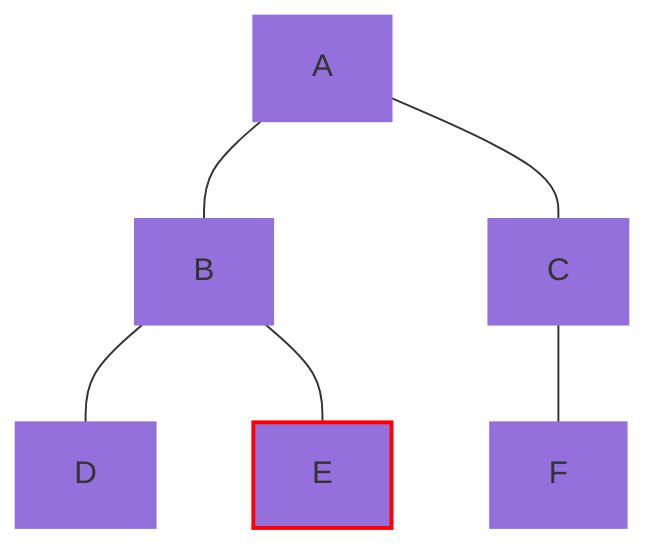
```mermaid
graph TD
 A---B;
 A---C;
 B---D;
 B---E;
 C---F;
 style A fill:#9370DB
 style B fill:#9370DB
 style C fill:#9370DB
 style D fill:#9370DB
 style E fill:#9370DB, stroke:red, stroke-width:2px
 style F fill:#9370DB
```

7. **Step 6**
- Dequeue node F from the queue
- Process(F)
- Node F has no unvisited adjacent nodes to enqueue
- Queue: [~~F~~][ ]
- Visited: [<kbd>A</kbd>, <kbd>B</kbd>, <kbd>C</kbd>, <kbd>D</kbd>, <kbd>E</kbd>, <kbd>F</kbd>]
- Processed: [<kbd>A</kbd>, <kbd>B</kbd>, <kbd>C</kbd>, <kbd>D</kbd>, <kbd>E</kbd>, <mark><kbd>F</kbd></mark>]

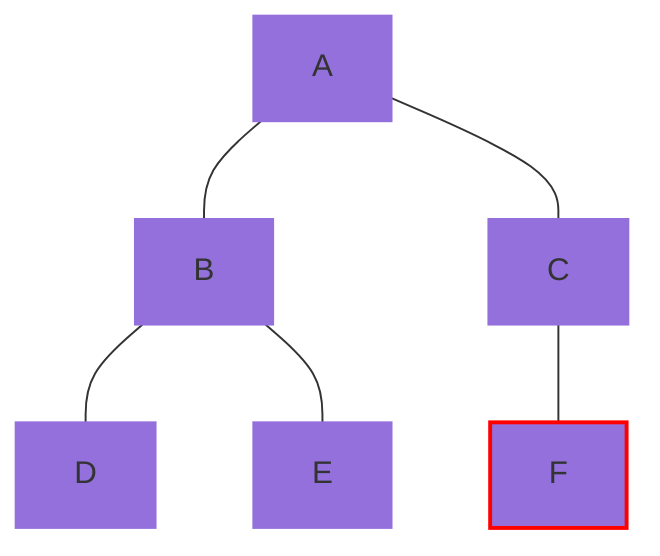
```mermaid
graph TD
 A---B;
 A---C;
 B---D;
 B---E;
 C---F;
 style A fill:#9370DB
 style B fill:#9370DB
 style C fill:#9370DB
 style D fill:#9370DB
 style E fill:#9370DB
 style F fill:#9370DB, stroke:red, stroke-width:2px
```

8. **End**
- The BFS traversal order is <kbd>A</kbd> &rarr; <kbd>B</kbd> &rarr; <kbd>C</kbd> &rarr; <kbd>D</kbd> &rarr; <kbd>E</kbd> &rarr; <kbd>F</kbd>.

### 2. 간단한 그래프

#### 2.1. 문제

아래와 같은 그래프에서 BFS 방식을 적용하여 탐색하시오. 탐색은 A 노드에서 시작한다.

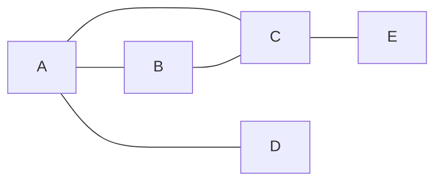
```mermaid
graph LR
 A---B;
 A---C;
 A----D;
 B---C;
 C---E;
```

#### 2.2. 풀이(iterative approach)

1. **Initialization**
- Start at node A
- Mark node A as visited
- Initialize a queue and enqueue node A into the queue
- Queue: [<mark><kbd>A</kbd></mark>]
- Visited: [<mark><kbd>A</kbd></mark>]
- Processed: [ ]

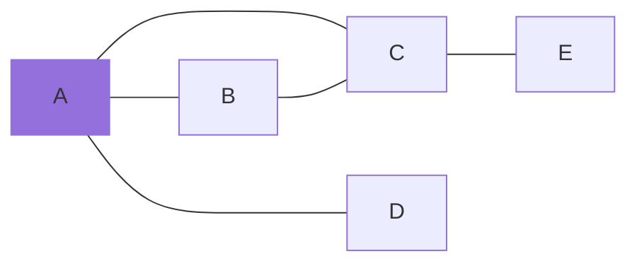
```mermaid
graph LR
 A---B;
 A---C;
 A----D;
 B---C;
 C---E;
 style A fill:#9370DB
```

2. **Step 1**
- Dequeue node A from the queue
- Process(A)
- Enqueue its unvisited adjacent nodes B, C, and D into the queue (order may vary), marking them as visited
- Queue: [~~A~~][<mark><kbd>B</kbd>, <kbd>C</kbd>, <kbd>D</kbd></mark>]
- Visited: [<kbd>A</kbd>, <mark><kbd>B</kbd>, <kbd>C</kbd>, <kbd>D</kbd></mark>]
- Processed: [<mark><kbd>A</kbd></mark>]

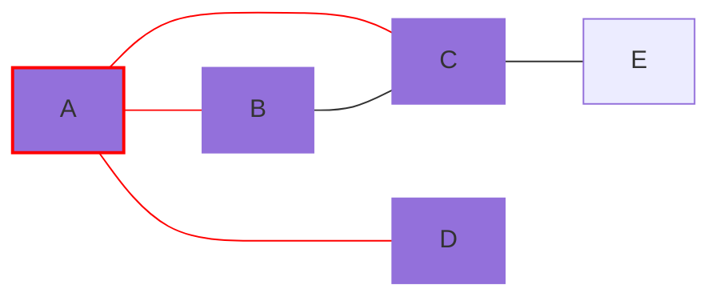
```mermaid
graph LR
 A---B;
 A---C;
 A----D;
 B---C;
 C---E;
 linkStyle 0,1,2 stroke:red
 style A fill:#9370DB, stroke:red, stroke-width:2px
 style B fill:#9370DB
 style C fill:#9370DB
 style D fill:#9370DB
```

3. **Step 2**
- Dequeue node B from the queue
- Process(B)
- Node B has no unvisited adjacent nodes to enqueue
- Queue: [~~B~~][<kbd>C</kbd>, <kbd>D</kbd>]
- Visited: [<kbd>A</kbd>, <kbd>B</kbd>, <kbd>C</kbd>, <kbd>D</kbd>]
- Processed: [<kbd>A</kbd>, <mark><kbd>B</kbd></mark>]

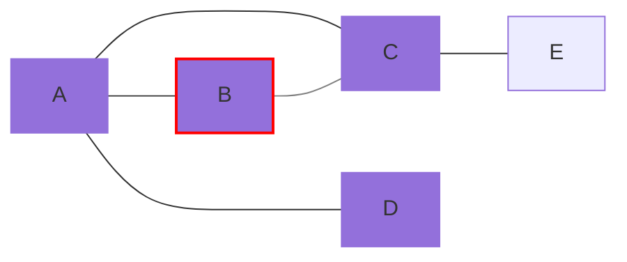
```mermaid
graph LR
 A---B;
 A---C;
 A----D;
 B---C;
 C---E;
 linkStyle 3 stroke:grey
 style A fill:#9370DB
 style B fill:#9370DB, stroke:red, stroke-width:2px
 style C fill:#9370DB
 style D fill:#9370DB
```

1. **Step 3**
- Dequeue node C from the queue
- Process(C)
- Enqueue its unvisited adjacent node E into the queue, marking it as visited.
- Queue: [~~C~~][<kbd>D</kbd>, <mark><kbd>E</kbd></mark>]
- Visited: [<kbd>A</kbd>, <kbd>B</kbd>, <kbd>C</kbd>, <kbd>D</kbd>, <mark><kbd>E</kbd></mark>]
- Processed: [<kbd>A</kbd>, <kbd>B</kbd>, <mark><kbd>C</kbd></mark>]

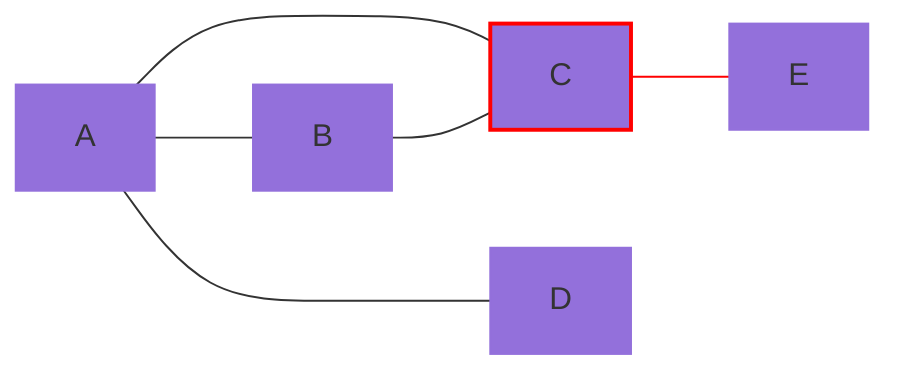
```mermaid
graph LR
 A---B;
 A---C;
 A----D;
 B---C;
 C---E;
 linkStyle 4 stroke:red
 style A fill:#9370DB
 style B fill:#9370DB
 style C fill:#9370DB, stroke:red, stroke-width:2px
 style D fill:#9370DB
 style E fill:#9370DB
```

5. **Step 4**
- Dequeue node D from the queue
- Process(D)
- Node D has no unvisited adjacent nodes to enqueue
- Queue: [~~D~~][<kbd>E</kbd>]
- Visited: [<kbd>A</kbd>, <kbd>B</kbd>, <kbd>C</kbd>, <kbd>D</kbd>, <kbd>E</kbd>]
- Processed: [<kbd>A</kbd>, <kbd>B</kbd>, <kbd>C</kbd>, <mark><kbd>D</kbd></mark>]

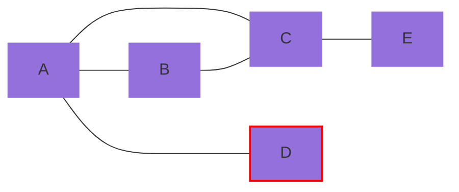
```mermaid
graph LR
 A---B;
 A---C;
 A----D;
 B---C;
 C---E;
 style A fill:#9370DB
 style B fill:#9370DB
 style C fill:#9370DB
 style D fill:#9370DB, stroke:red, stroke-width:2px
 style E fill:#9370DB
```

1. **Step 5**
- Dequeue node E from the queue
- Process(E)
- Node E has no unvisited adjacent nodes to enqueue
- Queue: [~~E~~][ ]
- Visited: [<kbd>A</kbd>, <kbd>B</kbd>, <kbd>C</kbd>, <kbd>D</kbd>, <kbd>E</kbd>]
- Processed: [<kbd>A</kbd>, <kbd>B</kbd>, <kbd>C</kbd>, <kbd>D</kbd>, <mark><kbd>E</kbd></mark>]

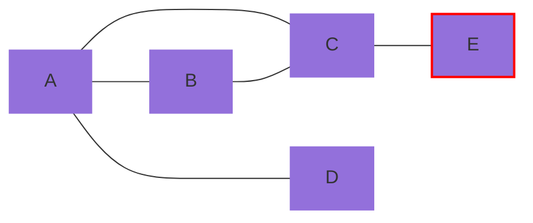
```mermaid
graph LR
 A---B;
 A---C;
 A----D;
 B---C;
 C---E;
 style A fill:#9370DB
 style B fill:#9370DB
 style C fill:#9370DB
 style D fill:#9370DB
 style E fill:#9370DB, stroke:red, stroke-width:2px
```

7. **End**
- The BFS traversal order is <kbd>A</kbd> &rarr; <kbd>B</kbd> &rarr; <kbd>C</kbd> &rarr; <kbd>D</kbd> &rarr; <kbd>E</kbd>.