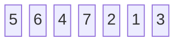
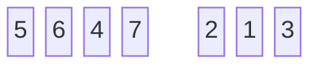
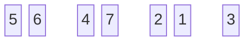
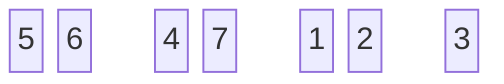
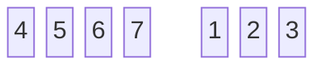
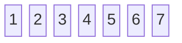

## 정의

병합 정렬(Merge Sort)은 분할 정복(Divde and Conquer) 알고리즘에 기반한 정렬 알고리즘입니다. 주어진 배열을 비슷한 크기의 두 개의 하위 배열로 나누어 **재귀적**으로 정렬합니다. 그리고 최종적으로 두 하위 배열을 병합하여 정렬된 배열을 얻습니다.

## 알고리즘 단계

1. 분할(Divde)

   - 배열이 하나의 원소가 될 때까지 절반으로(즉 두 개의 하위 배열로) 나누는 과정을 반복합니다.

2. 정복(Conquer)

   - 각 하위 배열을 재귀적으로 정렬합니다. 이 과정에서 배열의 크기가 1이면 정렬된 것으로 간주합니다.

3. 병합(Combine)

   - 두 개의 정렬된 하위 배열을 하나의 정렬된 배열로 병합합니다.

> 분할 단계를 배열의 크기가 1이 될 때까지 반복하는 이유는 **재귀적 구현**을 위한 것입니다.
{: .prompt-info}

## Pseudo Code

```python
def MERGE_SORT(array, left, right)
    if left < right:
        middle = (left + right) / 2
        MERGE_SORT(array, left, middle)
        MERGE_SORT(array, middle + 1, right)
        MERGE(array, left, middle, right)
```
```python
def MERGE(array, left, middle, right)
    n1 = middle - left + 1
    n2 = right - middle
    # Create temporary arrays L[0 ... n1-1] and R[0 ... n2-1]
    for i = 0 to n1:
        L[i] = array[left + i]
    for j = 0 to n2:
        R[j] = array[middle + j + 1]
    i = 0
    j = 0
    k = left
    while i < n1 and j < n2:
        if L[i] <= R[j]:
            array[k] = L[i]
            i = i + 1
        else:
            array[k] = R[j]
            j = j + 1
        k = k + 1
    # Copy remaining elements of L[], if any
    while i < n1:
        array[k] = L[i]
        i = i + 1
        k = k + 1
    # Copy remaining elements of R[], if any
    while j < n2
        array[k] = R[j]
        j = j + 1
        k = k + 1
```

> 위 알고리즘[^book-algorithm][^book-datastructure]은 정렬된 하위 배열을 임시로 저장히기 위한 배열을 필요로 합니다.
{: .prompt-info}


## 성능

### 시간 복잡도

1. 최악의 경우 (Worst Case): $O(n\log_2 n)$
2. 최선의 경우 (Best Case): $O(n\log_2 n)$
3. 평균의 경우 (Average Case): $O(n\log_2 n)$

병합 정렬의 시간 복잡도는 항상 $O(n\log_2 n)$입니다. 입력 데이터가 이미 정렬되어 있든, 역순으로 정렬되어 있든, 병합 정렬은 모든 경우에 대해 같은 시간 복잡도를 가집니다. 그 이유는 분할과 병합 과정이 데이터의 상태에 상관없이 항상 일정하게 수행되기 때문입니다. 여기서 $n$은 배열의 원소 개수입니다.

- 배열을 분할하는 과정은 $O(1)$만큼 시간이 소요됩니다.

- 배열을 병합하는 과정은 $\log_2 n$ 단계가 필요합니다.

- 각 병합 단계에서는 모든 원소를 한 번씩만 검사하게 되므로 $O(n)$만큼 시간이 소요됩니다.

### 공간 복잡도

병합 정렬은 **추가적인 배열 공간**을 필요로 하므로 공간 복잡도는 $O(n)$입니다. 이는 정렬된 하위 배열들을 저장하기 위해 **임시 메모리**가 필요하기 때문입니다.


## 예시

### 문제



#### 분할

배열이 하나의 원소가 될 때까지(정복될 때까지) 주어진 배열을 두 개의 하위 배열로 나누는 과정을 반복한다.






#### 정복 & 병합

나누었던 하위 배열을 **정렬 순서를 고려하여** 하나의 배열로 다시 병합한다.








#### 풀이 애니메이션

> 출처: http://algorithm.wiki/


## 참고

[^book-algorithm]: Cormen, Thomas H, Charles Eric Leiserson, and Ronald L Rivest. "2.3.1 The divide-and-conquer method," in *Introduction to Algorithms*. 4th ed. 34-39 Cambridge, Mass.: Mit Press, 2022.
[^book-datastructure]: 윤성우, "10장. 정렬(sorting)" in *윤성우의 열혈 자료구조: C언어를 이용한 자료구조 학습서*, 오렌지미디어(2012)